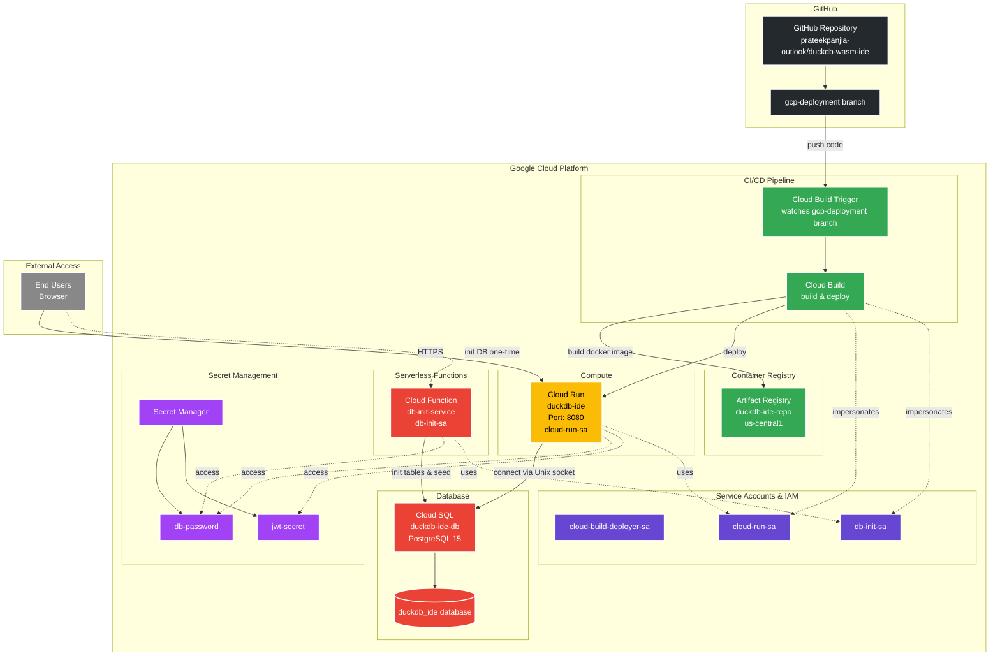
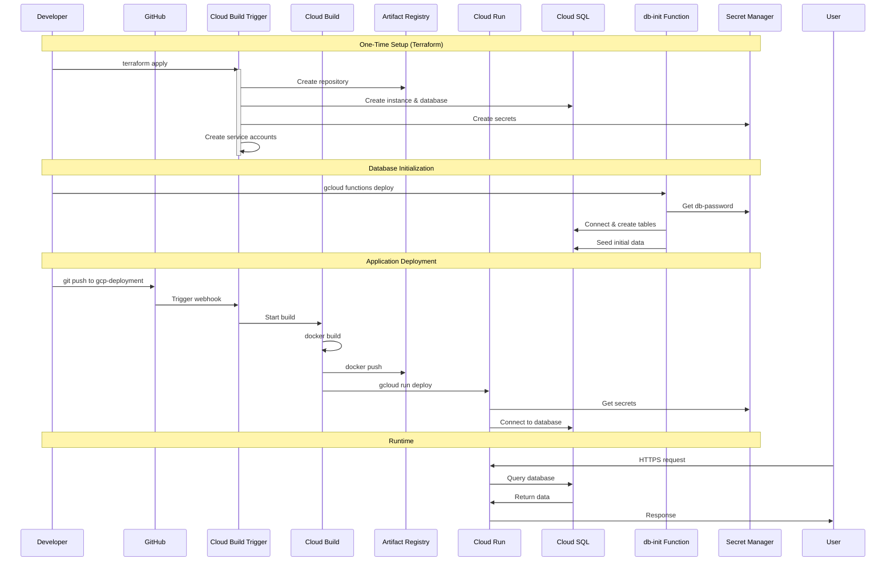
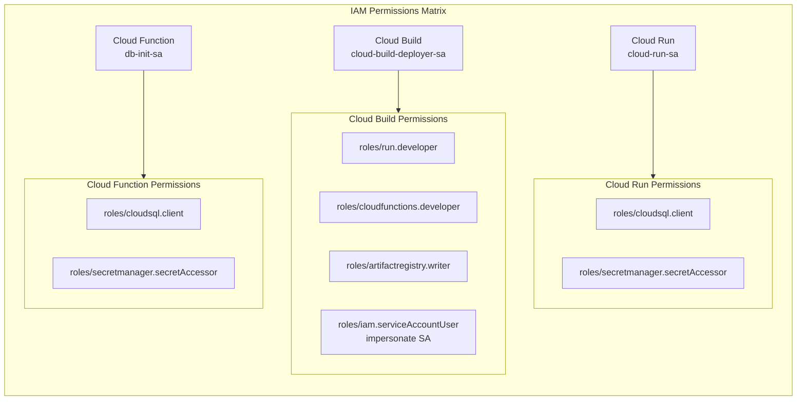
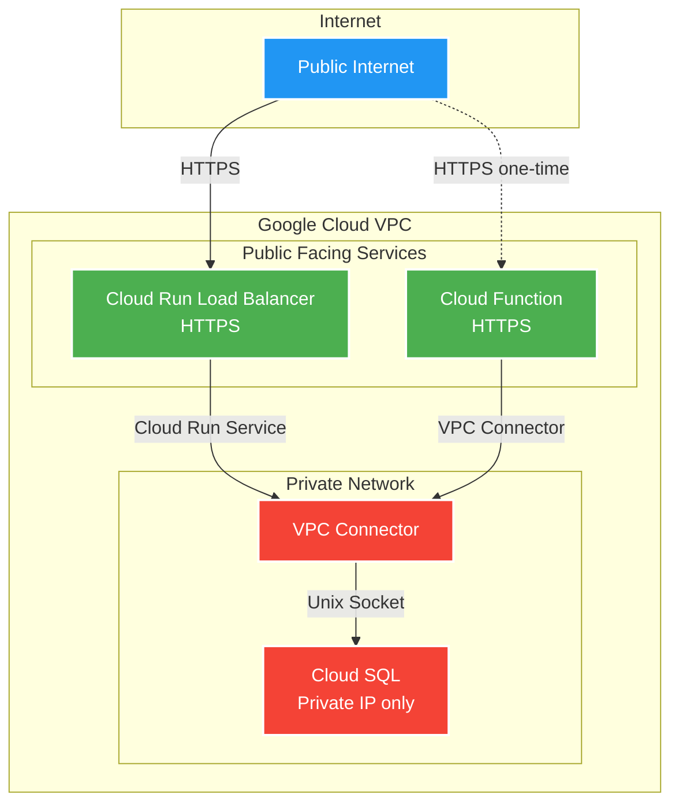
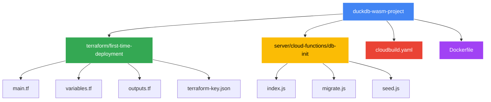
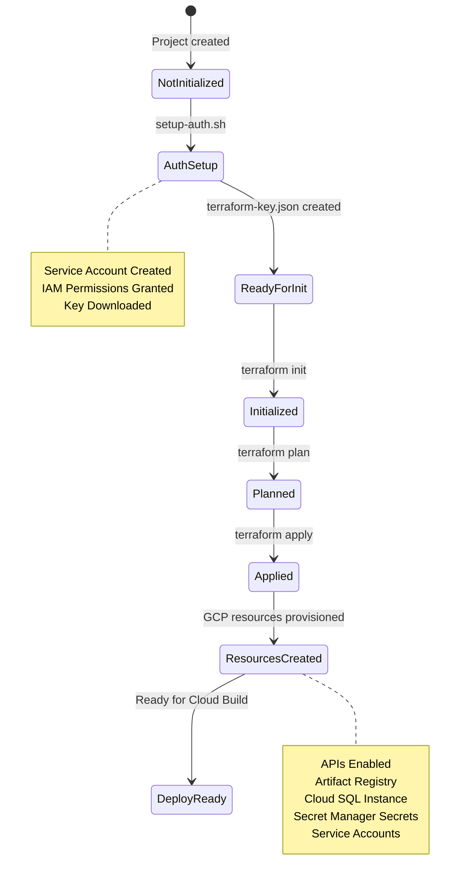

# GCP Deployment Architecture Diagram

## Overall Architecture

---

## Deployment Flow

---

## IAM Permissions Flow

---

## Network Connectivity

---

## File Structure & Resources

---

## Terraform State Flow

