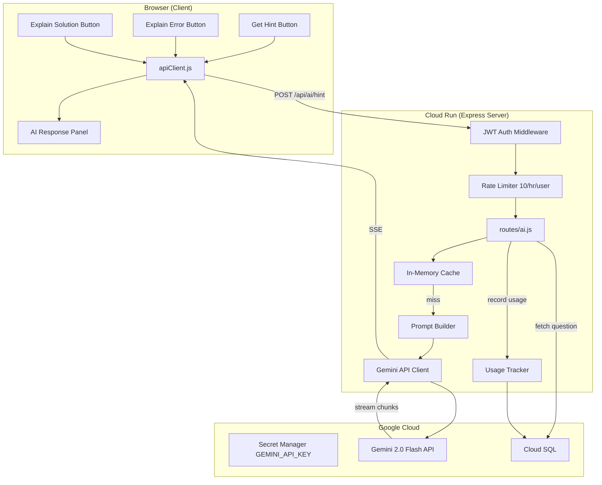
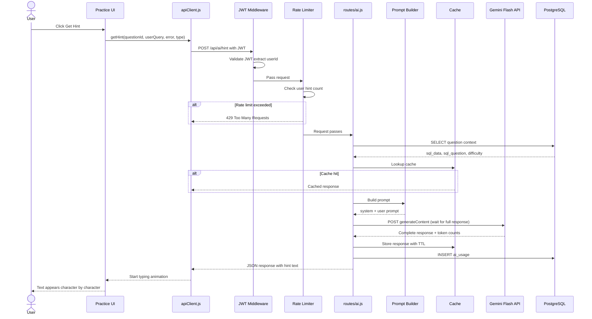

# Gemini AI Integration — Implementation Design

**GitHub Issue:** #33
**Model:** Gemini 2.0 Flash (server-side, regular POST + client typing animation)

## Table of Contents

- [Component Architecture](#component-architecture)
- [Implementation Sequence — Get Hint](#implementation-sequence--get-hint)
- [Data Flow — What Gets Passed at Each Step](#data-flow--what-gets-passed-at-each-step)
- [Prompt Templates by Type](#prompt-templates-by-type)
- [Files to Create/Modify](#files-to-createmodify)
- [Cost Estimate](#cost-estimate)
- [Response Delivery — SSE vs Regular POST](#response-delivery--sse-vs-regular-post)
- [Regular POST + Typing Animation — Detailed Analysis](#regular-post--typing-animation--detailed-analysis)
- [E2E Testing Strategy](#e2e-testing-strategy)

## Component Architecture



## Implementation Sequence — Get Hint



## Data Flow — What Gets Passed at Each Step

### 1. Browser → Server

```json
{
  "questionId": 1,
  "userQuery": "SELECT * FROM employees",
  "errorMessage": null,
  "type": "hint"
}
```

Types: `hint` | `explain_error` | `explain_solution`

### 2. Server → PostgreSQL (fetch question context)

```sql
SELECT sql_data, sql_question, sql_solution, difficulty
FROM questions WHERE id = $1
```

Server fetches context from DB — does NOT trust client-sent schema (prevents prompt injection).

### 3. Server → Gemini API

```json
{
  "contents": [{
    "role": "user",
    "parts": [{
      "text": "Table schema:\nCREATE TABLE employees (...)\n\nQuestion: Select all employees from Engineering\n\nStudent's query: SELECT * FROM employees\n\nError: none\n\nGive a hint without revealing the answer."
    }]
  }],
  "systemInstruction": {
    "parts": [{
      "text": "You are a SQL tutor for beginner level students practicing on DuckDB. Do NOT give the answer directly. Guide with hints. 2-3 sentences max."
    }]
  },
  "generationConfig": {
    "maxOutputTokens": 200,
    "temperature": 0.7
  }
}
```

### 4. Gemini → Server → Browser

Server waits for full Gemini response, returns as regular JSON:

```json
{
  "hint": "Think about which column to filter on. What SQL clause filters rows?",
  "cached": false,
  "tokens": { "input": 487, "output": 23 }
}
```

Client animates the text with a typing effect (see delivery approach below).

### 5. Server → PostgreSQL (record usage)

```sql
INSERT INTO ai_usage (user_id, question_id, type, input_tokens, output_tokens, cached)
VALUES ($1, $2, $3, $4, $5, false)
```

## Prompt Templates by Type

| Type | System instruction | User prompt suffix |
|------|-------------------|-------------------|
| `hint` | Do NOT give the answer. Guide with hints. | Give a hint. |
| `explain_error` | Explain the error in simple terms. Suggest how to fix it. | Explain this error: {errorMessage} |
| `explain_solution` | Explain the solution step by step. | Explain this solution: {sql_solution} |

## Files to Create/Modify

| File | Action | Purpose |
|------|--------|---------|
| `server/routes/ai.js` | Create | API endpoint /api/ai/hint |
| `server/services/gemini.js` | Create | Gemini API client with streaming |
| `server/services/promptBuilder.js` | Create | Build prompts by type |
| `server/server.js` | Modify | Register ai routes, add ai_usage table |
| `js/services/api-client.js` | Modify | Add getHint() |
| `js/services/practice-manager.js` | Modify | Add hint/error/solution buttons + AI panel |
| `index.html` | Modify | Add AI response panel HTML |
| `css/style.css` | Modify | AI panel styles |
| `cloudbuild.yaml` | Modify | Add GEMINI_API_KEY secret |
| `infra/terraform/main.tf` | Modify | Add gemini-api-key secret resource |

## Cost Estimate

| Item | Cost |
|------|------|
| Gemini Flash input ($0.10/1M tokens) | ~500 tokens/hint |
| Gemini Flash output ($0.40/1M tokens) | ~100 tokens/hint |
| Per hint | $0.00009 |
| 1000 hints/day | $2.70/month |
| Total project impact | $9 → $12/month |

## Response Delivery — SSE vs Regular POST

### Three options compared

| Approach | How it works | UX | Server complexity |
|----------|-------------|-----|-------------------|
| **SSE streaming** | Server relays Gemini chunks to browser in real-time via EventSource | Text appears word-by-word natively | High |
| **Regular POST, spinner** | Server waits for full response, returns JSON. Browser shows spinner then full text. | Spinner 0.5-1s, then text appears all at once | Low |
| **Regular POST + typing animation** | Same as above, but browser animates the text character-by-character after receiving it | Spinner 0.5-1s, then text "types out" like ChatGPT | Low |

### SSE analysis — constraints it imposes

#### Architecture

| Concern | Impact |
|---------|--------|
| Connection stays open 2-5s per hint | Cloud Run instance held busy longer. 1000 hints × 3s = 3000 instance-seconds/day (negligible at free tier) |
| One-directional (server→browser only) | Fine for single hint. If multi-turn chat needed later, each user message needs a separate POST anyway |
| Stateless Cloud Run | If instance scales down mid-stream, connection drops. Unlikely for 2-5s requests |

#### Implementation

| Concern | Impact |
|---------|--------|
| Express can't use `res.json()` | Must use `res.write()` chunks + `res.end()`. Different error handling pattern |
| Error mid-stream | Can't send HTTP status code after streaming starts. Must write error message into the stream itself |
| CORS + auth | `EventSource` API doesn't support custom headers (no JWT). Must use `fetch` with ReadableStream and parse SSE manually, or pass token as query param |
| Timeout handling | Must manage Cloud Run timeout (300s) and Gemini timeout separately. Hanging Gemini = hanging SSE |
| Testing | Playwright can't easily assert on partial stream content |

#### Operations

| Concern | Impact |
|---------|--------|
| Monitoring | SSE requests show as long requests in metrics. Skews average latency dashboards |
| Caching | Can't cache SSE at CDN/proxy level. Our in-memory cache handles this (cache hit = skip SSE, return JSON) |
| Rate limiting | Works normally — still one HTTP request per hint |

### Regular POST + typing animation analysis

#### Architecture

| Concern | Impact |
|---------|--------|
| Standard request/response | Connection released as soon as response sent. Cloud Run instance freed immediately |
| Same pattern as every other endpoint | No special infrastructure. Same auth, same error handling, same monitoring |
| Slightly higher latency | User sees spinner for 0.5-1s while server waits for Gemini. For 50-100 token hints, barely noticeable |

#### Implementation

| Concern | Impact |
|---------|--------|
| Server code | Standard `res.json()`. Identical to `/api/practice/verify` pattern |
| Error handling | Standard try/catch, return `{ error: "..." }`. No mid-stream error complexity |
| Auth | Standard `Authorization: Bearer` header. No workaround needed |
| Client typing animation | ~15 lines of JS to animate text character-by-character |
| Testing | Standard — assert on the final response JSON. No stream parsing |
| Caching | Standard HTTP caching works. Cache hit returns instantly (no animation delay) |

#### Client-side typing animation code

```javascript
async function typeText(element, text, speed = 30) {
    element.textContent = '';
    for (const char of text) {
        element.textContent += char;
        await new Promise(r => setTimeout(r, speed));
    }
}

// Usage after receiving hint:
const response = await apiClient.getHint(questionId, query, error, 'hint');
const aiPanel = document.getElementById('aiResponsePanel');
await typeText(aiPanel, response.hint);
```

#### Operations

| Concern | Impact |
|---------|--------|
| Monitoring | Normal request latency (0.5-1s for Gemini, appears in dashboards like any API call) |
| Debugging | Standard request/response logs. Full response in one log entry |
| Rate limiting | Same as any endpoint |

### Decision: Regular POST + typing animation

**Why:**
1. Zero additional architectural complexity — same pattern as all other endpoints
2. Hint responses are short (2-3 sentences, <1s generation) — SSE streaming barely visible
3. Typing animation gives the same UX feel as streaming
4. No CORS/auth workarounds, no mid-stream error handling, no special testing
5. If hints get longer or we add chat later, upgrade to SSE then

**When to reconsider SSE:**
- Multi-paragraph explanations (>500 tokens output)
- Multi-turn conversation (chat with AI tutor)
- Response time exceeds 3 seconds consistently

## Regular POST + Typing Animation — Detailed Analysis

### Architecture

| Concern | Analysis | Impact |
|---------|----------|--------|
| Request lifecycle | Standard HTTP POST → JSON response. Connection opens, server processes, responds, closes. Identical to `/api/practice/verify`. | None |
| Server blocking | Server `await`s Gemini (0.5-2s), holds request open. Cloud Run instance occupied during this time. | Low — same as any external API call |
| Failure modes | Gemini down → 503. Gemini slow → timeout. Gemini garbage → validate and 500. All standard HTTP error codes. | None — existing error patterns work |
| Scaling | 100 concurrent hints = 100 instances × ~1s each. At max-instances=10, 11th queues. | Low — hints are infrequent (manual button clicks) |
| Caching | In-memory cache. Cache hit = instant JSON, no Gemini call. Standard HTTP. | Positive |
| Separation of concerns | AI is server-side only. Browser knows nothing about Gemini. Could swap for Claude/GPT/local model without client changes. | Good — clean abstraction |
| State | Stateless. Each request independent. No conversation history on server. Multi-turn later = client sends history in each request. | None — matches existing model |
| Database | Optional `ai_usage` table. Additive. Existing 4 tables untouched. | None |

### Implementation

| Concern | Analysis | Impact |
|---------|----------|--------|
| Server route | `router.post('/hint', authenticate, rateLimit, handler)`. Same middleware chain as practice routes. | None — copy existing pattern |
| Gemini call | Single `fetch()` to googleapis.com. Parse JSON. Extract text. ~20 lines. | Low |
| Error handling | `try/catch`, return `{ error: "AI service unavailable" }`. Standard pattern. | None |
| Auth | Same JWT middleware. `req.user.id` for rate limiting and usage tracking. | None |
| Rate limiting | Separate `express-rate-limit` instance for AI (10/hr/user). Key by `req.user.id`. ~5 lines of config. | Low |
| Prompt building | Pure function: (question, userQuery, error, type) → (systemPrompt, userPrompt). Easy to test. | Low |
| Client: API call | `apiClient.getHint()` — standard POST, returns JSON. Same pattern as `verifySolution()`. | None |
| Client: typing animation | Animate text character-by-character after receiving full response. ~15 lines standalone JS. No library. | Low |
| Client: UI | Panel div for AI response. Three buttons (Hint, Explain Error, Explain Solution). CSS. | Medium — UI work |
| Client: loading state | "Thinking..." spinner while waiting. Same pattern as DuckDB query loading. | Low |
| Secret management | Add `GEMINI_API_KEY` to Secret Manager + `cloudbuild.yaml` `--set-secrets`. | Low — done twice already |
| Dependencies | Zero new npm packages. `fetch` is built into Node 18+. Gemini is a REST endpoint. | None |

### Operations

| Concern | Analysis | Impact |
|---------|----------|--------|
| Monitoring | `/api/ai/hint` in Cloud Run logs. Latency ~0.5-2s. Easy to filter and dashboard. | None — standard metrics |
| Cost tracking | `ai_usage` table: total tokens/month, top users, most-requested questions. | Positive |
| Gemini outage | Hints return 503. App continues — users still practice SQL. AI is non-critical. | None — graceful degradation |
| API key rotation | Update secret version → deploy new revision. Same as DB_PASSWORD. | None — existing pattern |
| Cloud Run billing | 1000 hints/day × 1s = 1000 instance-seconds/day. Free tier = 180,000 cpu-seconds/month. | Negligible |
| Gemini billing | $0.00009/hint. $2.70/month at 1000/day. Track via `ai_usage` table + GCP budget alerts. | Negligible |
| Logging | Log type, questionId, tokens, cache hit/miss, latency. Don't log prompt content (user data). | Low |
| Rollback | AI route is additive. Rollback = deploy without route. ai_usage table stays, no new rows. Blue/Green safe. | None |
| Multi-region cache | In-memory = per-instance. Multiple Cloud Run instances don't share cache. Cache miss = calls Gemini again. Upgrade to Redis later if needed. | Low — acceptable |

### Summary

| Dimension | New constraints? | Notes |
|-----------|-----------------|-------|
| Architecture | None | Same request/response model as all other endpoints |
| Implementation | Low | ~100 lines server + ~50 lines client. Zero new dependencies. |
| Operations | None | Standard monitoring, logging, billing. Graceful degradation on failure. |

## E2E Testing Strategy

### Challenge

E2E tests run against a real server. If they call the real Gemini API:
- Tests become flaky (Gemini latency varies, could timeout)
- Tests cost money (small but accumulates in CI)
- Tests depend on external service availability
- Test assertions are fragile (AI output varies each time)

### Approach: Mock Gemini at the server level

Create a test mode where the server returns a fixed response instead of calling Gemini.

```
Tests                    Express Server                 Gemini API
  │                          │                              │
  │ POST /api/ai/hint        │                              │
  │ ────────────────────────>│                              │
  │                          │ if (NODE_ENV === 'test')     │
  │                          │   return mock response       │
  │                          │ else                         │
  │                          │   call Gemini API ──────────>│
  │ <────────────────────────│                              │
  │ Assert on mock response  │                              │
```

### Implementation

In `server/routes/ai.js`:

```javascript
// Mock response for testing
const MOCK_HINT = {
    hint: "Think about which column to filter on. What SQL clause filters rows based on a condition?",
    cached: false,
    tokens: { input: 0, output: 0 }
};

router.post('/hint', authenticate, aiRateLimit, async (req, res) => {
    // ... validate request ...

    // Test mode — return mock without calling Gemini
    if (process.env.NODE_ENV === 'test' || !process.env.GEMINI_API_KEY) {
        return res.json(MOCK_HINT);
    }

    // Production — call Gemini
    // ...
});
```

### E2E test cases

```javascript
// tests/e2e/ai.spec.js

test.describe('AI Hints', () => {

    test('hint button appears after loading a question', async ({ page }) => {
        await loginAndLoadQuestion(page);
        await expect(page.locator('#getHintBtn')).toBeVisible();
    });

    test('clicking hint shows AI response panel', async ({ page }) => {
        await loginAndLoadQuestion(page);
        await page.locator('#getHintBtn').click();

        // Wait for typing animation to complete
        await expect(page.locator('#aiResponsePanel')).toBeVisible();
        await expect(page.locator('#aiResponsePanel')).not.toBeEmpty({ timeout: 10000 });
    });

    test('hint contains relevant text', async ({ page }) => {
        await loginAndLoadQuestion(page);
        await page.locator('#getHintBtn').click();

        // Mock returns predictable text
        await expect(page.locator('#aiResponsePanel'))
            .toContainText('column to filter', { timeout: 10000 });
    });

    test('explain error button appears after incorrect submission', async ({ page }) => {
        await loginAndLoadQuestion(page);
        await writeQuery(page, 'SELECT * FROM nonexistent_table');
        await page.locator('#submitCodeBtn').click();

        await expect(page.locator('#explainErrorBtn')).toBeVisible();
    });

    test('rate limit shows message after 10 hints', async ({ page }) => {
        await loginAndLoadQuestion(page);

        for (let i = 0; i < 11; i++) {
            await page.locator('#getHintBtn').click();
            await page.waitForTimeout(500);
        }

        await expect(page.locator('#aiResponsePanel'))
            .toContainText('rate limit', { timeout: 5000 });
    });

    test('hint works without GEMINI_API_KEY (mock mode)', async ({ page }) => {
        // Server started without GEMINI_API_KEY falls back to mock
        await loginAndLoadQuestion(page);
        await page.locator('#getHintBtn').click();

        await expect(page.locator('#aiResponsePanel'))
            .not.toContainText('error', { timeout: 10000 });
    });
});
```

### Test environments

| Environment | GEMINI_API_KEY | Behavior |
|-------------|---------------|----------|
| **Vagrant VM (local E2E)** | Not set | Mock response — tests pass without Gemini |
| **GitHub Actions CI** | Not set | Mock response — no Gemini cost in CI |
| **Cloud Run (production)** | Set via Secret Manager | Real Gemini calls |
| **Cloud Run (smoke test)** | Set | Could test real hint, but flaky — better to test endpoint returns 200 |

### Playwright cloud.spec.js additions

```javascript
// Add to existing cloud.spec.js for production smoke testing

test('AI hint endpoint responds', async ({ request }) => {
    // Register and get token
    const token = await getAuthToken(request);

    const resp = await request.post(`${BASE}/api/ai/hint`, {
        headers: { Authorization: `Bearer ${token}` },
        data: {
            questionId: 1,
            userQuery: 'SELECT * FROM employees',
            errorMessage: null,
            type: 'hint'
        }
    });

    expect(resp.status()).toBe(200);
    const body = await resp.json();
    expect(body.hint).toBeTruthy();
    expect(body.hint.length).toBeGreaterThan(10);
});

test('AI hint rate limiting works', async ({ request }) => {
    const token = await getAuthToken(request);

    // Send 11 requests (limit is 10/hr)
    let lastStatus;
    for (let i = 0; i < 11; i++) {
        const resp = await request.post(`${BASE}/api/ai/hint`, {
            headers: { Authorization: `Bearer ${token}` },
            data: { questionId: 1, userQuery: 'SELECT 1', type: 'hint' }
        });
        lastStatus = resp.status();
    }

    expect(lastStatus).toBe(429);
});

test('AI hint requires authentication', async ({ request }) => {
    const resp = await request.post(`${BASE}/api/ai/hint`, {
        data: { questionId: 1, userQuery: 'SELECT 1', type: 'hint' }
    });
    expect(resp.status()).toBe(401);
});
```

### Key testing decisions

| Decision | Rationale |
|----------|-----------|
| Mock by default, real in production | Keeps tests fast, free, and deterministic |
| Mock via env var (no GEMINI_API_KEY = mock) | No test config file needed. Same server binary, different behavior. |
| Don't assert on exact AI text in production | AI output varies. Assert on structure (200 status, non-empty hint, correct JSON shape). |
| Test typing animation separately | Unit test `typeText()` function with a fixed string. Don't test animation timing in E2E (flaky). |
