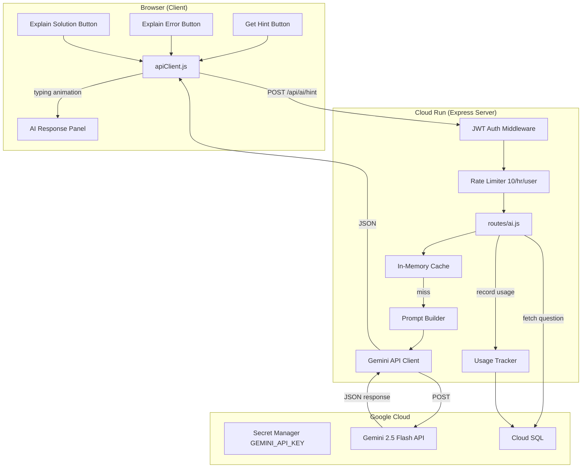
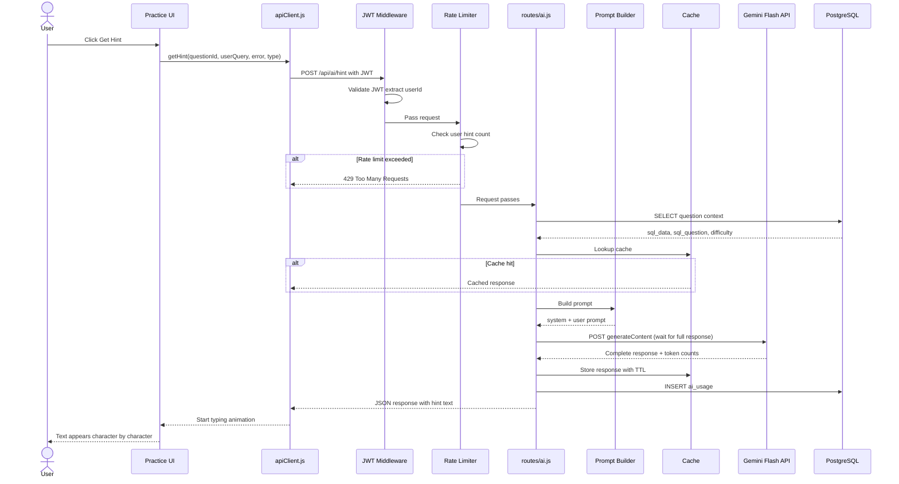

# Gemini AI Integration — Implementation Design

**GitHub Issue:** #33 (Closed)
**Model:** Gemini 2.5 Flash (server-side, regular POST + client typing animation)
**Status:** Deployed to Cloud Run

**Two usage modes:**
1. **AI Hints** (`POST /api/ai/hint`) — Single Gemini call, text generation, typing animation. For students.
2. **Question Authoring Agent** (`POST /api/admin/agent`) — Multi-step Gemini function calling loop with 8 tools. For admins. See [question-authoring-agent.md](./question-authoring-agent.md).

## Issues Encountered

| # | Issue | Root Cause | Fix |
|---|-------|-----------|-----|
| 1 | Gemini 2.5 Flash returned 404 | Model deprecated for new users | Switched default to `gemini-2.5-flash` |
| 2 | "Great question!" filler in responses | System prompt said "Be encouraging" | Changed to "Skip filler — go straight to the hint" |
| 3 | Explain Error button did nothing | Inline `onclick` broke when error messages contained quotes | Replaced with `addEventListener` + closure |
| 4 | AI panel not visible after clicking hint | No scroll-to-view after showing panel | Added `scrollIntoView({ behavior: 'smooth' })` |
| 5 | Error feedback panel overlapped AI response | Both panels visible simultaneously | Hide feedback panel when AI explanation requested |
| 6 | Responses truncated (7 visible tokens) | Gemini 2.5 Flash "thinking tokens" consume `maxOutputTokens` budget invisibly | Increased from 200 to 500 |
| 7 | Screenshot E2E test failing | Clicked "Load Question" before DuckDB WASM connected | Wait for `.status.connected` before loading |
| 8 | E2E tests hitting 429 rate limits | Multiple test runs exhausted Gemini free tier RPM | Added 30s delays between Gemini API tests |
| 9 | No logging for Gemini calls | Only error message logged | Added structured logging: latency, tokens, finish reason |
| 10 | No visual distinction between response types | Header always said "AI Tutor" | Shows "AI Hint", "Error Explanation", or "Solution Explanation" |

## Files Changed

### New files
| File | Purpose |
|------|---------|
| `server/routes/ai.js` | POST `/api/ai/hint` — auth, rate limit (10/hr/user), in-memory cache (1hr TTL), mock mode |
| `server/services/gemini.js` | Gemini API client — fetch, timeout, structured logging |
| `server/services/promptBuilder.js` | Builds system + user prompts by type and difficulty |
| `scripts/demo-gemini-hints.js` | Playwright headed demo for screen recording |

### Modified files
| File | Changes |
|------|---------|
| `server/server.js` | Register AI routes, `ai_usage` table in `ensureTables()` |
| `js/services/practice-manager.js` | `getAIHint()`, `typeText()`, `ensureAIPanel()`, hint/explain buttons, response labels, scroll, hide feedback |
| `js/services/api-client.js` | `getHint()` method |
| `css/style.css` | AI panel styles (`.ai-panel`, `.ai-thinking`, `.ai-cached`, `btn-info`, `btn-sm`) |
| `cloudbuild.yaml` | `GEMINI_API_KEY` in `--set-secrets` |
| `tests/e2e/cloud.spec.js` | 7 AI API tests, screenshot capture test, rate limit delays |

## Table of Contents

- [Component Architecture](#component-architecture)
- [Implementation Sequence — Get Hint](#implementation-sequence--get-hint)
- [Data Flow — What Gets Passed at Each Step](#data-flow--what-gets-passed-at-each-step)
- [Prompt Templates by Type](#prompt-templates-by-type)
- [Files to Create/Modify](#files-to-createmodify)
- [Cost Estimate](#cost-estimate)
- [Response Delivery — SSE vs Regular POST](#response-delivery--sse-vs-regular-post)
- [Regular POST + Typing Animation — Detailed Analysis](#regular-post--typing-animation--detailed-analysis)
- [E2E Testing Strategy](#e2e-testing-strategy)
- [Domain Knowledge Strategy — DuckDB Context for the LLM](#domain-knowledge-strategy--duckdb-context-for-the-llm)
- [Fine-tuning Deep Dive — Closed vs Open Models](#fine-tuning-deep-dive--closed-vs-open-models)

## Component Architecture



## Implementation Sequence — Get Hint



## Data Flow — What Gets Passed at Each Step

### 1. Browser → Server

```json
{
  "questionId": 1,
  "userQuery": "SELECT * FROM employees",
  "errorMessage": null,
  "type": "hint"
}
```

Types: `hint` | `explain_error` | `explain_solution`

### 2. Server → PostgreSQL (fetch question context)

```sql
SELECT sql_data, sql_question, sql_solution, difficulty
FROM questions WHERE id = $1
```

Server fetches context from DB — does NOT trust client-sent schema (prevents prompt injection).

### 3. Server → Gemini API

```json
{
  "contents": [{
    "role": "user",
    "parts": [{
      "text": "Table schema:\nCREATE TABLE employees (...)\n\nQuestion: Select all employees from Engineering\n\nStudent's query: SELECT * FROM employees\n\nError: none\n\nGive a hint without revealing the answer."
    }]
  }],
  "systemInstruction": {
    "parts": [{
      "text": "You are a SQL tutor for beginner level students practicing on DuckDB. Do NOT give the answer directly. Guide with hints. 2-3 sentences max."
    }]
  },
  "generationConfig": {
    "maxOutputTokens": 500,
    "temperature": 0.7
  }
}
```

### 4. Gemini → Server → Browser

Server waits for full Gemini response, returns as regular JSON:

```json
{
  "hint": "Think about which column to filter on. What SQL clause filters rows?",
  "cached": false,
  "tokens": { "input": 487, "output": 23 }
}
```

Client animates the text with a typing effect (see delivery approach below).

### 5. Server → PostgreSQL (record usage)

```sql
INSERT INTO ai_usage (user_id, question_id, type, input_tokens, output_tokens, cached)
VALUES ($1, $2, $3, $4, $5, false)
```

## Prompt Templates by Type

| Type | System instruction | User prompt suffix |
|------|-------------------|-------------------|
| `hint` | Do NOT give the answer. Guide with hints. | Give a hint. |
| `explain_error` | Explain the error in simple terms. Suggest how to fix it. | Explain this error: {errorMessage} |
| `explain_solution` | Explain the solution step by step. | Explain this solution: {sql_solution} |

## Files to Create/Modify

| File | Action | Purpose |
|------|--------|---------|
| `server/routes/ai.js` | Create | API endpoint /api/ai/hint |
| `server/services/gemini.js` | Create | Gemini API client with streaming |
| `server/services/promptBuilder.js` | Create | Build prompts by type |
| `server/server.js` | Modify | Register ai routes, add ai_usage table |
| `js/services/api-client.js` | Modify | Add getHint() |
| `js/services/practice-manager.js` | Modify | Add hint/error/solution buttons + AI panel |
| `index.html` | Modify | Add AI response panel HTML |
| `css/style.css` | Modify | AI panel styles |
| `cloudbuild.yaml` | Modify | Add GEMINI_API_KEY secret |
| `infra/terraform/main.tf` | Modify | Add gemini-api-key secret resource |

## Cost Estimate

| Item | Cost |
|------|------|
| Gemini Flash input ($0.10/1M tokens) | ~500 tokens/hint |
| Gemini Flash output ($0.40/1M tokens) | ~100 tokens/hint |
| Per hint | $0.00009 |
| 1000 hints/day | $2.70/month |
| Total project impact | $9 → $12/month |

## Response Delivery — SSE vs Regular POST

### Three options compared

| Approach | How it works | UX | Server complexity |
|----------|-------------|-----|-------------------|
| **SSE streaming** | Server relays Gemini chunks to browser in real-time via EventSource | Text appears word-by-word natively | High |
| **Regular POST, spinner** | Server waits for full response, returns JSON. Browser shows spinner then full text. | Spinner 0.5-1s, then text appears all at once | Low |
| **Regular POST + typing animation** | Same as above, but browser animates the text character-by-character after receiving it | Spinner 0.5-1s, then text "types out" like ChatGPT | Low |

### SSE analysis — constraints it imposes

#### Architecture

| Concern | Impact |
|---------|--------|
| Connection stays open 2-5s per hint | Cloud Run instance held busy longer. 1000 hints × 3s = 3000 instance-seconds/day (negligible at free tier) |
| One-directional (server→browser only) | Fine for single hint. If multi-turn chat needed later, each user message needs a separate POST anyway |
| Stateless Cloud Run | If instance scales down mid-stream, connection drops. Unlikely for 2-5s requests |

#### Implementation

| Concern | Impact |
|---------|--------|
| Express can't use `res.json()` | Must use `res.write()` chunks + `res.end()`. Different error handling pattern |
| Error mid-stream | Can't send HTTP status code after streaming starts. Must write error message into the stream itself |
| CORS + auth | `EventSource` API doesn't support custom headers (no JWT). Must use `fetch` with ReadableStream and parse SSE manually, or pass token as query param |
| Timeout handling | Must manage Cloud Run timeout (300s) and Gemini timeout separately. Hanging Gemini = hanging SSE |
| Testing | Playwright can't easily assert on partial stream content |

#### Operations

| Concern | Impact |
|---------|--------|
| Monitoring | SSE requests show as long requests in metrics. Skews average latency dashboards |
| Caching | Can't cache SSE at CDN/proxy level. Our in-memory cache handles this (cache hit = skip SSE, return JSON) |
| Rate limiting | Works normally — still one HTTP request per hint |

### Regular POST + typing animation analysis

#### Architecture

| Concern | Impact |
|---------|--------|
| Standard request/response | Connection released as soon as response sent. Cloud Run instance freed immediately |
| Same pattern as every other endpoint | No special infrastructure. Same auth, same error handling, same monitoring |
| Slightly higher latency | User sees spinner for 0.5-1s while server waits for Gemini. For 50-100 token hints, barely noticeable |

#### Implementation

| Concern | Impact |
|---------|--------|
| Server code | Standard `res.json()`. Identical to `/api/practice/verify` pattern |
| Error handling | Standard try/catch, return `{ error: "..." }`. No mid-stream error complexity |
| Auth | Standard `Authorization: Bearer` header. No workaround needed |
| Client typing animation | ~15 lines of JS to animate text character-by-character |
| Testing | Standard — assert on the final response JSON. No stream parsing |
| Caching | Standard HTTP caching works. Cache hit returns instantly (no animation delay) |

#### Client-side typing animation code

```javascript
async function typeText(element, text, speed = 30) {
    element.textContent = '';
    for (const char of text) {
        element.textContent += char;
        await new Promise(r => setTimeout(r, speed));
    }
}

// Usage after receiving hint:
const response = await apiClient.getHint(questionId, query, error, 'hint');
const aiPanel = document.getElementById('aiResponsePanel');
await typeText(aiPanel, response.hint);
```

#### Operations

| Concern | Impact |
|---------|--------|
| Monitoring | Normal request latency (0.5-1s for Gemini, appears in dashboards like any API call) |
| Debugging | Standard request/response logs. Full response in one log entry |
| Rate limiting | Same as any endpoint |

### Decision: Regular POST + typing animation

**Why:**
1. Zero additional architectural complexity — same pattern as all other endpoints
2. Hint responses are short (2-3 sentences, <1s generation) — SSE streaming barely visible
3. Typing animation gives the same UX feel as streaming
4. No CORS/auth workarounds, no mid-stream error handling, no special testing
5. If hints get longer or we add chat later, upgrade to SSE then

**When to reconsider SSE:**
- Multi-paragraph explanations (>500 tokens output)
- Multi-turn conversation (chat with AI tutor)
- Response time exceeds 3 seconds consistently

## Regular POST + Typing Animation — Detailed Analysis

### Architecture

| Concern | Analysis | Impact |
|---------|----------|--------|
| Request lifecycle | Standard HTTP POST → JSON response. Connection opens, server processes, responds, closes. Identical to `/api/practice/verify`. | None |
| Server blocking | Server `await`s Gemini (0.5-2s), holds request open. Cloud Run instance occupied during this time. | Low — same as any external API call |
| Failure modes | Gemini down → 503. Gemini slow → timeout. Gemini garbage → validate and 500. All standard HTTP error codes. | None — existing error patterns work |
| Scaling | 100 concurrent hints = 100 instances × ~1s each. At max-instances=10, 11th queues. | Low — hints are infrequent (manual button clicks) |
| Caching | In-memory cache. Cache hit = instant JSON, no Gemini call. Standard HTTP. | Positive |
| Separation of concerns | AI is server-side only. Browser knows nothing about Gemini. Could swap for Claude/GPT/local model without client changes. | Good — clean abstraction |
| State | Stateless. Each request independent. No conversation history on server. Multi-turn later = client sends history in each request. | None — matches existing model |
| Database | Optional `ai_usage` table. Additive. Existing 4 tables untouched. | None |

### Implementation

| Concern | Analysis | Impact |
|---------|----------|--------|
| Server route | `router.post('/hint', authenticate, rateLimit, handler)`. Same middleware chain as practice routes. | None — copy existing pattern |
| Gemini call | Single `fetch()` to googleapis.com. Parse JSON. Extract text. ~20 lines. | Low |
| Error handling | `try/catch`, return `{ error: "AI service unavailable" }`. Standard pattern. | None |
| Auth | Same JWT middleware. `req.user.id` for rate limiting and usage tracking. | None |
| Rate limiting | Separate `express-rate-limit` instance for AI (10/hr/user). Key by `req.user.id`. ~5 lines of config. | Low |
| Prompt building | Pure function: (question, userQuery, error, type) → (systemPrompt, userPrompt). Easy to test. | Low |
| Client: API call | `apiClient.getHint()` — standard POST, returns JSON. Same pattern as `verifySolution()`. | None |
| Client: typing animation | Animate text character-by-character after receiving full response. ~15 lines standalone JS. No library. | Low |
| Client: UI | Panel div for AI response. Three buttons (Hint, Explain Error, Explain Solution). CSS. | Medium — UI work |
| Client: loading state | "Thinking..." spinner while waiting. Same pattern as DuckDB query loading. | Low |
| Secret management | Add `GEMINI_API_KEY` to Secret Manager + `cloudbuild.yaml` `--set-secrets`. | Low — done twice already |
| Dependencies | Zero new npm packages. `fetch` is built into Node 18+. Gemini is a REST endpoint. | None |

### Operations

| Concern | Analysis | Impact |
|---------|----------|--------|
| Monitoring | `/api/ai/hint` in Cloud Run logs. Latency ~0.5-2s. Easy to filter and dashboard. | None — standard metrics |
| Cost tracking | `ai_usage` table: total tokens/month, top users, most-requested questions. | Positive |
| Gemini outage | Hints return 503. App continues — users still practice SQL. AI is non-critical. | None — graceful degradation |
| API key rotation | Update secret version → deploy new revision. Same as DB_PASSWORD. | None — existing pattern |
| Cloud Run billing | 1000 hints/day × 1s = 1000 instance-seconds/day. Free tier = 180,000 cpu-seconds/month. | Negligible |
| Gemini billing | $0.00009/hint. $2.70/month at 1000/day. Track via `ai_usage` table + GCP budget alerts. | Negligible |
| Logging | Log type, questionId, tokens, cache hit/miss, latency. Don't log prompt content (user data). | Low |
| Rollback | AI route is additive. Rollback = deploy without route. ai_usage table stays, no new rows. Blue/Green safe. | None |
| Multi-region cache | In-memory = per-instance. Multiple Cloud Run instances don't share cache. Cache miss = calls Gemini again. Upgrade to Redis later if needed. | Low — acceptable |

### Summary

| Dimension | New constraints? | Notes |
|-----------|-----------------|-------|
| Architecture | None | Same request/response model as all other endpoints |
| Implementation | Low | ~100 lines server + ~50 lines client. Zero new dependencies. |
| Operations | None | Standard monitoring, logging, billing. Graceful degradation on failure. |

## E2E Testing Strategy

### Challenge

E2E tests run against a real server. If they call the real Gemini API:
- Tests become flaky (Gemini latency varies, could timeout)
- Tests cost money (small but accumulates in CI)
- Tests depend on external service availability
- Test assertions are fragile (AI output varies each time)

### Approach: Mock Gemini at the server level

Create a test mode where the server returns a fixed response instead of calling Gemini.

```
Tests                    Express Server                 Gemini API
  │                          │                              │
  │ POST /api/ai/hint        │                              │
  │ ────────────────────────>│                              │
  │                          │ if (NODE_ENV === 'test')     │
  │                          │   return mock response       │
  │                          │ else                         │
  │                          │   call Gemini API ──────────>│
  │ <────────────────────────│                              │
  │ Assert on mock response  │                              │
```

### Implementation

In `server/routes/ai.js`:

```javascript
// Mock response for testing
const MOCK_HINT = {
    hint: "Think about which column to filter on. What SQL clause filters rows based on a condition?",
    cached: false,
    tokens: { input: 0, output: 0 }
};

router.post('/hint', authenticate, aiRateLimit, async (req, res) => {
    // ... validate request ...

    // Test mode — return mock without calling Gemini
    if (process.env.NODE_ENV === 'test' || !process.env.GEMINI_API_KEY) {
        return res.json(MOCK_HINT);
    }

    // Production — call Gemini
    // ...
});
```

### E2E test cases

```javascript
// tests/e2e/ai.spec.js

test.describe('AI Hints', () => {

    test('hint button appears after loading a question', async ({ page }) => {
        await loginAndLoadQuestion(page);
        await expect(page.locator('#getHintBtn')).toBeVisible();
    });

    test('clicking hint shows AI response panel', async ({ page }) => {
        await loginAndLoadQuestion(page);
        await page.locator('#getHintBtn').click();

        // Wait for typing animation to complete
        await expect(page.locator('#aiResponsePanel')).toBeVisible();
        await expect(page.locator('#aiResponsePanel')).not.toBeEmpty({ timeout: 10000 });
    });

    test('hint contains relevant text', async ({ page }) => {
        await loginAndLoadQuestion(page);
        await page.locator('#getHintBtn').click();

        // Mock returns predictable text
        await expect(page.locator('#aiResponsePanel'))
            .toContainText('column to filter', { timeout: 10000 });
    });

    test('explain error button appears after incorrect submission', async ({ page }) => {
        await loginAndLoadQuestion(page);
        await writeQuery(page, 'SELECT * FROM nonexistent_table');
        await page.locator('#submitCodeBtn').click();

        await expect(page.locator('#explainErrorBtn')).toBeVisible();
    });

    test('rate limit shows message after 10 hints', async ({ page }) => {
        await loginAndLoadQuestion(page);

        for (let i = 0; i < 11; i++) {
            await page.locator('#getHintBtn').click();
            await page.waitForTimeout(500);
        }

        await expect(page.locator('#aiResponsePanel'))
            .toContainText('rate limit', { timeout: 5000 });
    });

    test('hint works without GEMINI_API_KEY (mock mode)', async ({ page }) => {
        // Server started without GEMINI_API_KEY falls back to mock
        await loginAndLoadQuestion(page);
        await page.locator('#getHintBtn').click();

        await expect(page.locator('#aiResponsePanel'))
            .not.toContainText('error', { timeout: 10000 });
    });
});
```

### Test environments

| Environment | GEMINI_API_KEY | Behavior |
|-------------|---------------|----------|
| **Vagrant VM (local E2E)** | Not set | Mock response — tests pass without Gemini |
| **GitHub Actions CI** | Not set | Mock response — no Gemini cost in CI |
| **Cloud Run (production)** | Set via Secret Manager | Real Gemini calls |
| **Cloud Run (smoke test)** | Set | Could test real hint, but flaky — better to test endpoint returns 200 |

### Playwright cloud.spec.js additions

```javascript
// Add to existing cloud.spec.js for production smoke testing

test('AI hint endpoint responds', async ({ request }) => {
    // Register and get token
    const token = await getAuthToken(request);

    const resp = await request.post(`${BASE}/api/ai/hint`, {
        headers: { Authorization: `Bearer ${token}` },
        data: {
            questionId: 1,
            userQuery: 'SELECT * FROM employees',
            errorMessage: null,
            type: 'hint'
        }
    });

    expect(resp.status()).toBe(200);
    const body = await resp.json();
    expect(body.hint).toBeTruthy();
    expect(body.hint.length).toBeGreaterThan(10);
});

test('AI hint rate limiting works', async ({ request }) => {
    const token = await getAuthToken(request);

    // Send 11 requests (limit is 10/hr)
    let lastStatus;
    for (let i = 0; i < 11; i++) {
        const resp = await request.post(`${BASE}/api/ai/hint`, {
            headers: { Authorization: `Bearer ${token}` },
            data: { questionId: 1, userQuery: 'SELECT 1', type: 'hint' }
        });
        lastStatus = resp.status();
    }

    expect(lastStatus).toBe(429);
});

test('AI hint requires authentication', async ({ request }) => {
    const resp = await request.post(`${BASE}/api/ai/hint`, {
        data: { questionId: 1, userQuery: 'SELECT 1', type: 'hint' }
    });
    expect(resp.status()).toBe(401);
});
```

### Key testing decisions

| Decision | Rationale |
|----------|-----------|
| Mock by default, real in production | Keeps tests fast, free, and deterministic |
| Mock via env var (no GEMINI_API_KEY = mock) | No test config file needed. Same server binary, different behavior. |
| Don't assert on exact AI text in production | AI output varies. Assert on structure (200 status, non-empty hint, correct JSON shape). |
| Test typing animation separately | Unit test `typeText()` function with a fixed string. Don't test animation timing in E2E (flaky). |

## Domain Knowledge Strategy — DuckDB Context for the LLM

### Current approach: name-drop in system prompt

Our system prompts say "practicing on DuckDB." Gemini 2.5 Flash already has DuckDB knowledge from training data (docs, GitHub, StackOverflow). For beginner-to-intermediate SQL, standard SQL and DuckDB overlap almost entirely, so this works.

### When this breaks down

If users attempt DuckDB-specific syntax (e.g., `EXCLUDE`, `COLUMNS(*)`, `LIST`/`STRUCT` types, `PIVOT`/`UNPIVOT`) and Gemini gives MySQL/PostgreSQL answers instead, we'd need to add context.

### Three approaches for giving an LLM domain knowledge

#### 1. Context stuffing (cheapest, do first)

Pack relevant docs into the system prompt. No infrastructure needed.

```javascript
const DUCKDB_REFERENCE = `
DuckDB-specific syntax the student may use:
- EXCLUDE: SELECT * EXCLUDE (column) FROM t
- COLUMNS(*): SELECT COLUMNS(*) FROM t (expands to all columns)
- LIST/STRUCT types: SELECT [1,2,3] AS my_list
- LIMIT x OFFSET y (not LIMIT y,x like MySQL)
- String concat: || operator (not CONCAT())
- PIVOT/UNPIVOT supported natively
`;

// Append to system prompt when needed
systemPrompt += DUCKDB_REFERENCE;
```

**Pros**: Zero infrastructure. Works immediately.
**Cons**: Eats tokens on every request (~100 extra tokens). Limited by context window (though Gemini 2.5 Flash has 1M tokens, so this is not a real constraint for docs).

**Best for**: Well-known libraries where the model mostly knows but occasionally confuses with similar tech. Our current situation.

#### 2. RAG (Retrieval-Augmented Generation)

Store library docs in a vector database. At request time, embed the user's question, retrieve the most relevant doc chunks, inject only those into the prompt.

```
User asks about LIST type
  → vector search finds "DuckDB LIST documentation" chunk
  → inject that chunk into the prompt
  → model answers with accurate DuckDB LIST syntax
```

**Infrastructure**: Vector DB (Vertex AI Search, Pinecone, pgvector) + embedding pipeline + retrieval service.

**Pros**: Only sends relevant context per request (saves tokens). Scales to large doc sets (1000s of pages). Docs can be updated without redeploying.
**Cons**: Retrieval quality matters — bad retrieval = bad answers. More moving parts to maintain. Latency overhead (embedding + search adds ~100-300ms).

**Best for**: Large or frequently changing documentation. Libraries with 100+ pages of reference material. When you can't afford to stuff everything into every prompt.

#### 3. Fine-tuning

Train a custom model variant on your library's docs, examples, and Q&A pairs. The knowledge is baked into the model weights.

**Pros**: No per-request context cost. Fastest inference (no retrieval step). Deepest understanding.
**Cons**: Most expensive to create and maintain. Needs curated training data. Model snapshot becomes stale when docs change — must retrain. Not all models support it.

**Best for**: Completely novel libraries with zero web presence. High-volume production where per-request token savings matter at scale.

#### Decision matrix

| Factor | Context stuffing | RAG | Fine-tuning |
|--------|-----------------|-----|-------------|
| Setup cost | None | Medium (vector DB + pipeline) | High (training data + training run) |
| Per-request cost | ~$0.00001 extra | ~$0.00005 (embedding + less context) | None (baked in) |
| Latency | None | +100-300ms | None |
| Doc freshness | Redeploy to update | Update vector DB (minutes) | Retrain model (hours/days) |
| Accuracy | Good for small ref | Good for large docs | Best for deep knowledge |
| Maintenance | Low | Medium | High |

### Our recommendation

**Now**: Context stuffing. Add a small DuckDB-specific reference to the system prompt only if we observe Gemini giving non-DuckDB answers. Cost: ~$0.01/month extra.

**If we add more databases or complex features**: RAG with pgvector (we already have PostgreSQL). Store DuckDB docs as embeddings, retrieve per-request.

**Fine-tuning**: Not justified for our scale. Would only consider if building a dedicated SQL tutoring product with millions of requests/month.

### Fine-tuning deep dive — closed vs open models

#### Why you can't fine-tune Gemini locally

Gemini is a **closed-weight model**. Google does not release the model weights (the billions of parameters that make the model work). You can only:
- Call it via API (pay per token)
- Fine-tune it via Vertex AI (Google runs the training on their infrastructure, gives you a custom endpoint)

You never download Gemini. You never see its weights. Fine-tuning happens on Google's TPUs, and the result lives on Google's servers.

The same applies to OpenAI (GPT-4, GPT-4o), Anthropic (Claude), and other closed providers.

#### Open-weight models you CAN fine-tune locally

These models publish their weights — you download them and run them on your own hardware:

| Model | Parameters | Min GPU VRAM (fine-tuning) | Min GPU VRAM (inference) |
|-------|-----------|---------------------------|-------------------------|
| Llama 3.1 8B | 8 billion | ~24 GB (with QLoRA) | ~6 GB (quantized) |
| Llama 3.1 70B | 70 billion | ~80 GB (multi-GPU) | ~40 GB (quantized) |
| Mistral 7B | 7 billion | ~24 GB (with QLoRA) | ~6 GB (quantized) |
| Phi-3 Mini | 3.8 billion | ~16 GB (with QLoRA) | ~4 GB (quantized) |
| Gemma 2 9B | 9 billion | ~24 GB (with QLoRA) | ~8 GB (quantized) |

"Open-weight" means you get the model files, but the license may restrict commercial use — check each model's license.

#### What you need to fine-tune locally

**Hardware**:
- GPU with enough VRAM. Consumer GPUs: RTX 4090 (24 GB) can fine-tune 7-9B models with QLoRA. Professional: A100 (40/80 GB) or H100.
- For larger models: multiple GPUs or cloud GPU rental (Lambda Labs, RunPod, vast.ai — $1-3/hr for an A100).
- CPU-only fine-tuning is technically possible but impractically slow (days vs hours).

**Software stack**:
- Python 3.10+
- PyTorch 2.x
- Hugging Face ecosystem: `transformers`, `datasets`, `peft` (for LoRA), `trl` (for RLHF)
- `bitsandbytes` for quantization (reduces VRAM requirements)

#### Step-by-step: fine-tuning Llama 3.1 8B on DuckDB knowledge

**Step 1 — Prepare training data**

Create JSONL file with instruction/response pairs:

```jsonl
{"instruction": "A student is learning DuckDB. They wrote SELECT * FROM t LIMIT 5,10. Explain the error.", "response": "DuckDB doesn't support MySQL's LIMIT offset,count syntax. Use LIMIT 10 OFFSET 5 instead."}
{"instruction": "Explain the EXCLUDE clause in DuckDB.", "response": "EXCLUDE lets you select all columns except specific ones: SELECT * EXCLUDE (salary, ssn) FROM employees. It's DuckDB-specific — not available in PostgreSQL or MySQL."}
{"instruction": "What does SELECT [1,2,3] return in DuckDB?", "response": "It returns a LIST literal of type INTEGER[]. DuckDB has native support for nested types including LIST, STRUCT, MAP, and UNION."}
```

You need at minimum ~100-500 high-quality examples. More helps but has diminishing returns.

**Step 2 — Install dependencies**

```bash
pip install torch transformers datasets peft trl bitsandbytes accelerate
```

**Step 3 — Fine-tune with QLoRA (parameter-efficient)**

QLoRA freezes the original model weights and trains small adapter layers (~0.1% of parameters). This is what makes fine-tuning possible on consumer GPUs.

```python
from datasets import load_dataset
from transformers import AutoTokenizer, AutoModelForCausalLM, BitsAndBytesConfig
from peft import LoraConfig, get_peft_model, prepare_model_for_kbit_training
from trl import SFTTrainer, SFTConfig

# 1. Load base model in 4-bit quantization (fits in 24GB VRAM)
bnb_config = BitsAndBytesConfig(
    load_in_4bit=True,
    bnb_4bit_quant_type="nf4",
    bnb_4bit_compute_dtype="float16",
)

model_name = "meta-llama/Meta-Llama-3.1-8B-Instruct"
model = AutoModelForCausalLM.from_pretrained(model_name, quantization_config=bnb_config)
tokenizer = AutoTokenizer.from_pretrained(model_name)

# 2. Configure LoRA adapters
lora_config = LoraConfig(
    r=16,                # rank — higher = more capacity, more VRAM
    lora_alpha=32,       # scaling factor
    target_modules=["q_proj", "v_proj", "k_proj", "o_proj"],  # which layers to adapt
    lora_dropout=0.05,
    task_type="CAUSAL_LM",
)

model = prepare_model_for_kbit_training(model)
model = get_peft_model(model, lora_config)

# 3. Load your training data
dataset = load_dataset("json", data_files="duckdb_training.jsonl", split="train")

# 4. Train
training_config = SFTConfig(
    output_dir="./duckdb-llama-adapter",
    num_train_epochs=3,
    per_device_train_batch_size=4,
    learning_rate=2e-4,
    logging_steps=10,
    save_strategy="epoch",
)

trainer = SFTTrainer(
    model=model,
    train_dataset=dataset,
    tokenizer=tokenizer,
    args=training_config,
)

trainer.train()

# 5. Save the LoRA adapter (small — typically 10-50 MB)
model.save_pretrained("./duckdb-llama-adapter")
```

**Step 4 — Test the fine-tuned model locally**

```python
from peft import PeftModel

# Load base model + your adapter
base_model = AutoModelForCausalLM.from_pretrained(model_name, quantization_config=bnb_config)
model = PeftModel.from_pretrained(base_model, "./duckdb-llama-adapter")

prompt = "A student wrote: SELECT * EXCLUDE salary FROM employees; What's wrong?"
inputs = tokenizer(prompt, return_tensors="pt").to("cuda")
output = model.generate(**inputs, max_new_tokens=200)
print(tokenizer.decode(output[0]))
```

**Step 5 — Deploy for inference**

Options for serving the model:

| Option | How | Cost |
|--------|-----|------|
| **Local** | `vllm serve` or `text-generation-webui` on your GPU machine | Electricity only |
| **Cloud GPU** | RunPod serverless, Lambda Labs, GCP g2-standard (L4 GPU) | $0.50-3/hr |
| **Hugging Face Inference Endpoints** | Upload adapter to HF Hub, create endpoint | $0.60/hr (small GPU) |
| **Ollama** | Package as GGUF, run `ollama serve` locally | Free (your hardware) |

#### Full fine-tuning vs LoRA vs QLoRA

| Method | What it trains | VRAM needed (8B model) | Output size | Quality |
|--------|---------------|----------------------|-------------|---------|
| **Full fine-tuning** | All parameters | ~60 GB | ~16 GB (full model copy) | Best |
| **LoRA** | Small adapter layers | ~32 GB | ~50 MB (adapter only) | Very good |
| **QLoRA** | Same as LoRA, but base model is 4-bit quantized | ~16-24 GB | ~50 MB (adapter only) | Good (slight quality loss from quantization) |

QLoRA is the sweet spot for local fine-tuning — a single RTX 4090 can fine-tune an 8B model.

#### Cost comparison: fine-tuning vs API

For our SQL practice project (~100 hints/day):

| Approach | Monthly cost |
|----------|-------------|
| Gemini 2.5 Flash API (current) | ~$0.27 |
| Fine-tuned on Vertex AI | ~$0.27 + $10-50 per retraining |
| Self-hosted Llama 8B on cloud GPU | ~$400-800 (24/7 GPU) |
| Self-hosted Llama 8B on local GPU | ~$15 electricity |

Self-hosting only makes economic sense at very high volume (>10,000 requests/day) or when you need complete data privacy (no data leaves your network).
