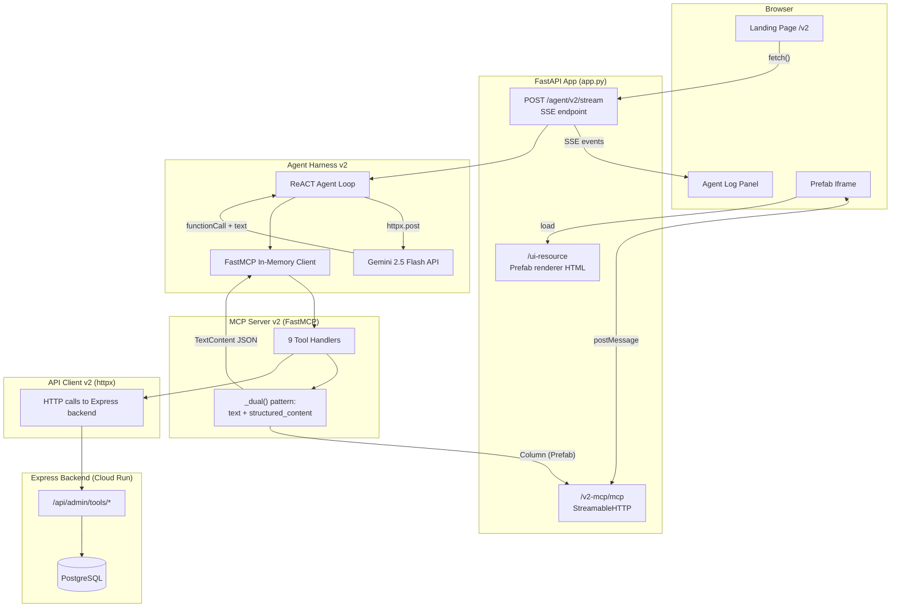
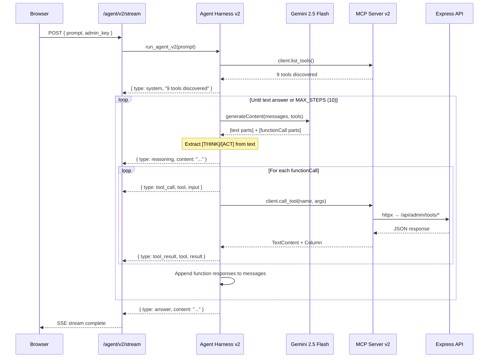

# MCP Agent v2 Architecture — ReACT Reasoning

## 1. Overview

The v2 MCP agent is a Question Authoring Agent for the SQL practice platform. An admin submits a natural-language prompt (e.g., "Add a question about HAVING"), and the agent autonomously researches coverage gaps, designs a question with schema and solution, validates it, checks concept overlap, and presents a preview — all in a single session with no mid-run pauses.

### What changed from v1

| Aspect | v1 | v2 |
|---|---|---|
| System prompt | Workflow-only instructions | Adds ReACT reasoning framework (`[THINK]`, `[ACT]`, `[VERIFY]`, `[FALLBACK]`, `[REASON_TYPE]`) |
| SSE event types | `tool_call`, `tool_result`, `answer`, `error`, `system` | All v1 types plus `reasoning` |
| Browser UI | Agent log + Prefab iframe | Same layout, adds collapsible reasoning cards with purple accent |
| MCP mount path | `/mcp` (root-level) | `/v2-mcp/mcp` (isolated sub-app) |
| SSE endpoint | `POST /agent/stream` | `POST /agent/v2/stream` |
| Landing page | `GET /` | `GET /v2` |
| Package isolation | Top-level modules | `mcp/v2/` sub-package with `config_v2`, `mcp_server_v2`, `agent_harness_v2`, `components_v2`, `api_client_v2`, `er_diagram_v2` |
| Prompt eval score | Not measured | 9/9 on the prompt evaluation rubric |

The tool set, Express API endpoints, Prefab UI rendering approach, and Gemini model are identical between v1 and v2. The v2 changes are entirely about adding visible reasoning to the agent loop and isolating the v2 code so both versions can run side by side in the same Cloud Run service.

---

## 2. Architecture Diagram

### Full System Flow



### ReACT Agent Loop (detail)



---

## 3. Component Rationale

### FastMCP (Python MCP server framework)

FastMCP provides the Model Context Protocol server with minimal boilerplate. Each tool is a decorated async function that returns a `ToolResult`. FastMCP handles:
- Schema generation from Python type hints (auto-converted to JSON Schema for Gemini)
- In-memory client transport (no HTTP hop between agent and MCP server within the same process)
- StreamableHTTP transport for the browser's Prefab iframe connection
- The `app=True` flag that enables structured_content (Prefab Column) alongside text content

The in-memory transport is critical: the agent harness imports the `mcp_v2` server instance directly and connects via `Client(mcp_server)`, avoiding a network round-trip for every tool call.

### Gemini 2.5 Flash (LLM)

Gemini 2.5 Flash was chosen for:
- Native function calling (`functionDeclarations` + `functionCallingConfig: AUTO`)
- Parallel tool calls in a single response (Gemini can return multiple `functionCall` parts)
- Low latency and cost for a multi-step agent loop (up to 10 Gemini calls per session)
- `temperature: 0.3` for deterministic SQL generation
- `maxOutputTokens: 8192` to accommodate large JSON question previews

The agent converts MCP tool schemas to Gemini's `functionDeclarations` format at startup, stripping fields Gemini does not accept (`$defs`, `title`, `additionalProperties`).

### Prefab UI (iframe-based rendering)

Prefab is the MCP-native UI framework for rendering structured tool results in the browser. Each tool returns a `Column` (Prefab layout component) as `structured_content` alongside JSON text. The browser connects to the MCP server via StreamableHTTP, and an `AppBridge` instance routes Prefab components into an iframe.

Key design decisions:
- Return `Column` not `Page` (Prefab constraint)
- Use `P` not `Paragraph`, `Code` not `CodeBlock` (Prefab naming)
- `TableCell` only accepts strings — no nested components
- `Badge(label, variant)` for visual categorization
- `CallTool` action on buttons for approve/insert workflows
- `Mermaid` component for ER diagrams
- `render_dashboard` aggregates all tool results into a single scrollable Column

### ReACT Reasoning Framework

The v2 system prompt adds five labeled reasoning markers:

| Label | Purpose | When used |
|---|---|---|
| `[THINK]` | Chain-of-thought: what do I know, what do I need, why this tool | Before every tool call |
| `[ACT]` | Declare which tool will be called and why | Before every tool call |
| `[REASON_TYPE]` | Classify the reasoning step (`concept_selection`, `schema_design`, `data_generation`, `query_logic`, `verification`, `error_recovery`) | Before every tool call |
| `[VERIFY]` | Self-check a tool result for correctness | After tool results, especially `validate_question` |
| `[FALLBACK]` | Explain what went wrong and the recovery plan | When validation fails or results are unexpected |

The reasoning text is emitted as a separate SSE event (`type: reasoning`) before the tool call events. The `build_reasoning_card` function in `components_v2.py` parses these labels with regex and renders them as Badge + text rows in a Prefab Card.

### SSE Streaming (Server-Sent Events)

The agent streams results to the browser in real time via SSE (`text/event-stream`). Each step in the agent loop yields a dict that is JSON-serialized and sent as a `data:` line. Event types:

| Event type | Payload | Rendered as |
|---|---|---|
| `system` | `{ content }` | Yellow system message in agent log |
| `reasoning` | `{ content, latencyMs }` | Purple collapsible card in agent log + reasoning card in Prefab |
| `tool_call` | `{ tool, input, latencyMs }` | Blue tool call entry in agent log |
| `tool_result` | `{ tool, result }` | Green result entry in agent log + Prefab UI section |
| `answer` | `{ content, latencyMs }` | Purple answer entry in agent log + question preview in Prefab |
| `error` | `{ content, latencyMs? }` | Red error entry in agent log |
| `done` | `{}` | Triggers final dashboard render |

The browser accumulates all tool results in `dashboardResults[]` and periodically calls `render_dashboard` via MCP to update the Prefab iframe. A 10-second debounce prevents excessive re-renders during rapid tool calls.

### Dual Content Pattern

Every tool (except `render_dashboard`) returns both text and structured content using the `_dual()` helper:

```python
def _dual(data: dict, column: Column) -> ToolResult:
    return ToolResult(
        content=[TextContent(type="text", text=json.dumps(data))],
        structured_content=column,
    )
```

- **Text content** (JSON string): Sent back to Gemini as `functionResponse`. The LLM reads this to decide its next action.
- **Structured content** (Prefab Column): Sent to the browser's Prefab iframe for rich rendering. The LLM never sees this.

This separation means the LLM gets compact JSON while the admin sees tables, badges, code blocks, and interactive buttons.

---

## 4. Request Flow — "Add a question about HAVING"

Below is the step-by-step walkthrough of a typical agent session.

### Step 0: Initialization

1. Admin visits `GET /v2`, loads the landing page with agent log + Prefab iframe.
2. Browser's module script connects an MCP client to `/v2-mcp/mcp` (StreamableHTTP).
3. AppBridge connects the Prefab iframe to the MCP client.

### Step 1: Prompt submission

1. Admin enters "Add a question about HAVING" and clicks Run Agent.
2. Browser `POST /agent/v2/stream` with `{ prompt, admin_key }`.
3. FastAPI route calls `run_agent_v2(prompt)` and streams SSE events.

### Step 2: MCP connection + tool discovery

1. Agent creates an in-memory `Client(mcp_server)` session.
2. `client.list_tools()` returns 9 tools. `render_dashboard` is excluded from Gemini declarations.
3. SSE: `{ type: system, content: "MCP connected -- 8 tools discovered" }`

### Step 3: First Gemini call — coverage gaps

1. System prompt + "Admin request: Add a question about HAVING" sent to Gemini.
2. Gemini responds with reasoning text + `functionCall: get_coverage_gaps`.
3. SSE: `{ type: reasoning, content: "[THINK] I need to check which concepts lack questions... [ACT] Calling get_coverage_gaps..." }`
4. SSE: `{ type: tool_call, tool: "get_coverage_gaps" }`
5. MCP tool calls Express API `GET /api/admin/tools/coverage-gaps`.
6. SSE: `{ type: tool_result, tool: "get_coverage_gaps", result: { gaps_by_category: {...}, total_gaps: N } }`

### Step 4: Second Gemini call — list existing questions

1. Agent waits 10 seconds (rate limit), sends conversation history to Gemini.
2. Gemini: reasoning + `functionCall: list_existing_questions`.
3. MCP tool calls `GET /api/admin/tools/questions`.
4. Agent learns `next_order_index` and `used_table_names`.

### Step 5: Third Gemini call — validate question

1. Gemini generates a complete question JSON and calls `validate_question(sql_data, sql_solution)`.
2. MCP tool calls `POST /api/admin/tools/validate`.
3. Express creates tables in a sandboxed transaction, runs the solution, checks distinguishability.
4. If validation fails, Gemini emits `[FALLBACK]` reasoning and retries with fixes.

### Step 6: Fourth Gemini call — check concept overlap

1. Gemini calls `check_concept_overlap(["HAVING", "GROUP BY"])`.
2. MCP tool calls `POST /api/admin/tools/concept-overlap`.
3. Returns which concepts are already covered, which are new.

### Step 7: Final answer — question preview

1. Gemini emits a text response with the complete question as a JSON code block.
2. SSE: `{ type: answer, content: "```json\n{...}\n```" }`
3. Browser adds `_answer` entry to `dashboardResults[]`.
4. `render_dashboard` is called via MCP: the `build_answer_preview` function detects the JSON structure and delegates to `build_question_preview`.
5. Prefab iframe shows the full question with schema, ER diagram, solution, explanation, concept badges, and an "Approve & Insert" button.

### Step 8: Admin approval (optional)

1. Admin clicks "Approve & Insert" in the Prefab iframe.
2. The button's `CallTool` action triggers `insert_question` via MCP.
3. Express inserts the question into PostgreSQL and tags concepts.

---

## 5. Tool Descriptions

The v2 MCP server exposes 9 tools. All except `render_dashboard` are sent to Gemini as function declarations.

### Tools for LLM (8)

| Tool | Method | Express endpoint | Purpose |
|---|---|---|---|
| `get_coverage_gaps` | GET | `/api/admin/tools/coverage-gaps` | Returns SQL concepts with zero intended questions — curriculum gaps |
| `list_existing_questions` | GET | `/api/admin/tools/questions` | Lists all questions with topics, difficulty, order indices, and used table names |
| `list_concepts` | GET | `/api/admin/tools/concepts` | Full taxonomy of ~35 SQL concepts with intended/alternative coverage counts |
| `validate_question` | POST | `/api/admin/tools/validate` | Creates tables, runs solution, checks distinguishability from `SELECT *` |
| `execute_sql` | POST | `/api/admin/tools/execute-sql` | Runs arbitrary SQL to test correctness |
| `check_concept_overlap` | POST | `/api/admin/tools/concept-overlap` | Checks if the given concepts already have questions covering them |
| `insert_question` | POST | `/api/admin/tools/insert` | Inserts a validated and admin-approved question into the database |
| `generate_test` | POST | `/api/admin/tools/generate-test` | Generates a Playwright E2E test for a given question |

### UI-only tool (1)

| Tool | Purpose |
|---|---|
| `render_dashboard` | Aggregates all tool results into a single scrollable Prefab Column. Called by the browser (not by Gemini). Excluded from `functionDeclarations` via `EXCLUDED_TOOLS`. |

### API Client

All tools delegate to `ApiClient` (`v2/tools/api_client_v2.py`), which makes `httpx` async HTTP calls to the Express backend at `CLOUD_RUN_BASE` (default: `https://duckdb-ide-frxi6yk4jq-uc.a.run.app`). Every request includes an `X-Admin-Key` header for authentication.

---

## 6. Reasoning Framework

### Labels and their semantics

```
[THINK]       Chain-of-thought before a tool call (2-4 sentences)
[REASON_TYPE] Classification: concept_selection | schema_design |
              data_generation | query_logic | verification | error_recovery
[ACT]         Declaration of which tool will be called and why
[VERIFY]      Self-check after a tool result
[FALLBACK]    Recovery plan when something fails
```

### How the agent emits reasoning

In the Gemini response, the model returns both text parts and `functionCall` parts. The agent harness extracts them:

```python
text_part = next((p for p in parts if p.get("text", "").strip()), None)
tool_calls = [p for p in parts if "functionCall" in p]

if text_part and tool_calls:
    # Emit reasoning BEFORE tool calls
    yield { "type": "reasoning", "content": text_part["text"] }
```

Reasoning is only yielded when text appears alongside tool calls. A text-only response (no tool calls) is treated as the final answer.

### How build_reasoning_card parses labels

The `build_reasoning_card` function in `components_v2.py` uses regex to extract each label:

```python
pattern = rf"\[{label}\]\s*(.+?)(?=\[(?:THINK|REASON_TYPE|VERIFY|FALLBACK|ACT)\]|$)"
```

It renders:
- A `Card` with header badges: "Reasoning" + the `REASON_TYPE` value
- Each label (except `REASON_TYPE`) as a `Badge` + `P` row, truncated to 200 chars

### Nudge mechanism

If Gemini returns a text-only response without having used any tools (e.g., it tries to answer from memory), the agent nudges it:

```python
if tool_calls_made == 0 and step_count < MAX_STEPS:
    messages.append({
        "role": "user",
        "parts": [{"text": "You MUST use the available tools..."}],
    })
```

This ensures the agent always grounds its output in real data from the Express API.

---

## 7. Known Issues

### 7.1 v2 MCP Isolation Failure

**Problem:** The v2 landing page initially connected its Prefab iframe MCP client to `/mcp`, which is v1's MCP server. This meant the v2 UI rendered components using v1's tool handlers, defeating the isolation goal.

**Root cause:** Both v1 and v2 MCP sub-apps expose a `/mcp` route internally. When both were mounted at the root, the v1 mount shadowed v2.

**Fix:** Mount the v2 MCP sub-app at `/v2-mcp`, so its StreamableHTTP endpoint lives at `/v2-mcp/mcp`. The v2 landing page's JavaScript connects to `new URL("/v2-mcp/mcp", window.location.origin)`. The v1 mount stays at `/` (reachable at `/mcp`). Mount order in `app.py`:

```python
app.mount("/v2-mcp", mcp_v2_app)   # v2 first (more specific path)
app.mount("/", mcp_app)             # v1 last (catch-all)
```

### 7.2 Gemini thoughtSignature vs Visible Reasoning

**Problem:** After the first step, Gemini 2.5 Flash switches from emitting visible `[THINK]`/`[ACT]` text to using opaque `thoughtSignature` fields on `functionCall` parts. The reasoning text disappears from the response, making steps 2+ appear to have no reasoning.

**Impact:** The `build_reasoning_card` function receives empty or absent reasoning text for later steps. The agent log shows reasoning only for step 1.

**Workaround:** The agent preserves `thoughtSignature` in message history (required by Gemini for multi-turn consistency) and logs its presence:

```python
if tc.get("thoughtSignature"):
    print(f"[LLM] Thought signature: {name} ({len(tc['thoughtSignature'])} chars)")
```

No fix is available — this is Gemini API behavior. Visible reasoning depends on the model choosing to emit text alongside function calls.

### 7.3 Markdown Special Characters in v2 Output

**Problem:** v2 output contains markdown special characters (backticks, asterisks, brackets) that did not appear in v1. This is because the ReACT system prompt encourages the model to emit structured labels like `[THINK]` and code blocks, which bleed into the final answer text.

**Impact:** Minor rendering issues in the agent log panel when displaying raw answer text.

### 7.4 finishReason STOP with Empty Parts

**Problem:** Gemini occasionally returns a response with `finishReason: STOP` but empty `parts` array. The agent treated this as an error and terminated the loop.

**Fix:** The agent checks for empty parts explicitly before processing:

```python
if not candidates or not candidates[0].get("content", {}).get("parts"):
    finish = candidates[0].get("finishReason", "unknown") if candidates else "no candidates"
    yield {"type": "error", "content": f"Empty Gemini response ({finish})"}
    break
```

This produces a clear error message identifying the finish reason instead of crashing on missing keys.

---

## 8. Deployment

### Cloud Run Service

- **Service name:** `duckdb-ide-mcp`
- **Region:** us-central1
- **Base URL:** `https://duckdb-ide-mcp-frxi6yk4jq-uc.a.run.app`
- **Port:** 8080

### Path Routing

| Path | Handler |
|---|---|
| `GET /` | v1 landing page |
| `GET /v2` | v2 landing page (ReACT) |
| `POST /agent/stream` | v1 SSE agent endpoint |
| `POST /agent/v2/stream` | v2 SSE agent endpoint |
| `/mcp` | v1 MCP StreamableHTTP (Prefab iframe) |
| `/v2-mcp/mcp` | v2 MCP StreamableHTTP (Prefab iframe) |
| `GET /ui-resource` | Prefab renderer HTML (shared by v1 and v2) |
| `GET /js/*` | Static JS (sdk-bundle.js, app-bridge.js, zod-v4.js) |
| `GET /health` | Health check |

### Dockerfile (multi-stage build)

The Dockerfile has three stages:

1. **js-deps** (node:18-alpine): Installs npm packages and bundles `sdk-bundle.js` with esbuild. This bundles the MCP SDK (`@modelcontextprotocol/sdk`) for browser use.

2. **py-deps** (python:3.12-slim): Installs Python dependencies from `requirements.txt` and patches `app-bridge.js` — replaces `esm.sh` CDN URLs with local `/js/` paths so the service works without external CDN dependencies.

3. **production** (python:3.12-slim): Copies Python packages, application code, and bundled JS. Removes build artifacts. Runs `uvicorn app:app` on port 8080.

### Environment Variables

| Variable | Purpose | Default |
|---|---|---|
| `GEMINI_API_KEY` | Gemini API authentication | (required) |
| `GEMINI_MODEL` | Model name | `gemini-2.5-flash` |
| `ADMIN_KEY` | Express API admin authentication | (required at runtime) |
| `CLOUD_RUN_BASE` | Express backend URL | `https://duckdb-ide-frxi6yk4jq-uc.a.run.app` |
| `PORT` | HTTP listen port | `8080` |
| `PYTHONIOENCODING` | Force UTF-8 output | `utf-8` |

### Lifespan Composition

Both v1 and v2 MCP sub-apps need their async lifespans to run (they initialize StreamableHTTP session managers). The `combined_lifespan` context manager nests them:

```python
@asynccontextmanager
async def combined_lifespan(app_instance):
    async with mcp_app.lifespan(app_instance):
        async with mcp_v2_app.lifespan(app_instance):
            yield
```

### Agent Configuration

| Setting | Value | Purpose |
|---|---|---|
| `MAX_STEPS` | 10 | Maximum Gemini calls per session |
| `CALL_DELAY_SECONDS` | 10 | Rate-limit delay between Gemini calls |
| `MAX_OUTPUT_TOKENS` | 8192 | Gemini output token limit |
| `temperature` | 0.3 | Low temperature for deterministic SQL |

---

## 9. File Map

```
mcp/
  app.py                        # FastAPI app, routes, landing pages (v1 + v2)
  agent_harness.py              # v1 agent loop
  mcp_server.py                 # v1 MCP server
  config.py                     # v1 config
  Dockerfile                    # Multi-stage build (Node + Python)
  v2/
    __init__.py
    agent_harness_v2.py         # v2 agent loop with ReACT reasoning
    mcp_server_v2.py            # v2 MCP server (9 tools, dual content)
    config_v2.py                # v2 config (same defaults, isolated module)
    tools/
      __init__.py
      api_client_v2.py          # httpx client for Express API
    ui/
      __init__.py
      components_v2.py          # Prefab builders + build_reasoning_card
      er_diagram_v2.py          # SQL → Mermaid ER diagram parser
  static/
    js/
      sdk-bundle.js             # Bundled MCP SDK for browser
      app-bridge.js             # Patched FastMCP AppBridge (no CDN)
      zod-v4.js                 # Zod validation (Prefab dependency)
```
