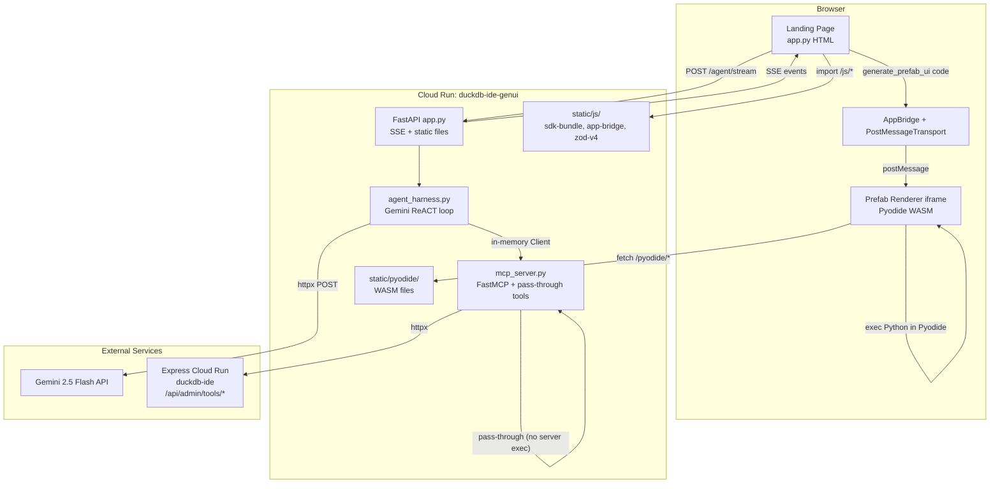
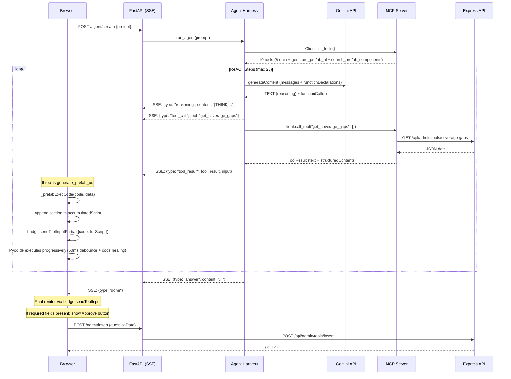
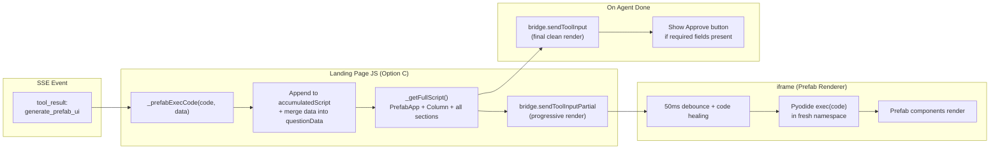

# MCP v3 Generative UI Architecture

## 1. Overview

The v3 "Generative UI" (GenUI) agent is the third iteration of the MCP-based Question Authoring Agent for the DuckDB SQL practice platform. It lives in `mcp-genui/` as a standalone service, deployed separately from the v1/v2 agents in `mcp/`.

### How v1, v2, and v3 Differ

| Aspect | v1 (MCP) | v2 (MCP + ReACT) | v3 (MCP + GenUI) |
|---|---|---|---|
| **LLM** | Gemini function calling | Gemini + ReACT reasoning framework | Gemini + ReACT + Generative UI |
| **UI rendering** | Server-side Prefab (structuredContent) | Server-side Prefab + reasoning cards | LLM writes Python Prefab code at runtime; Pyodide renders in browser |
| **Tool count** | 8 data tools | 8 data tools + render_dashboard | 8 data tools + generate_prefab_ui + search_prefab_components |
| **UI authorship** | Developer writes fixed Prefab builders | Developer writes fixed Prefab builders | LLM writes Prefab code per-step; developer provides component library |
| **Deployment** | Shared Cloud Run service (duckdb-ide-mcp) | Same service, /v2 routes | Separate Cloud Run service (duckdb-ide-genui) |
| **Key innovation** | MCP tool discovery | Visible chain-of-thought | LLM-generated visualizations via browser-side Python execution |

The core idea of v3: instead of the developer pre-building a Prefab layout for every tool result, the LLM itself writes Python code using the Prefab component library. That code is transmitted to the browser via SSE, then executed in Pyodide (Python compiled to WebAssembly) inside the Prefab renderer iframe.

---

## 2. Architecture Diagram

### System Overview



### SSE Event Flow



### Pyodide Rendering Path



---

## 3. Component Rationale

### Pass-Through Tools (No Server-Side Execution)

The `generate_prefab_ui` and `search_prefab_components` tools are registered as simple `@mcp.tool()` functions. `generate_prefab_ui` is a **pass-through** — it returns `"[Rendered Prefab UI]"` without executing any code. The actual Python code is sent to the browser via SSE and executed client-side by Pyodide. `search_prefab_components` calls `prefab_ui.generative.search_components()` for component discovery.

> **Note**: The original design used `mcp.add_provider(GenerativeUI())` which included a Deno sandbox for server-side code validation. This was removed because: (1) The browser Pyodide is the real executor, (2) Deno had different imports causing false errors (NameError, TypeError), (3) It added ~40MB to the Docker image, (4) It added latency to every tool call.

### Pyodide (Python in WASM)

The LLM writes Python code using the `prefab_ui.components` library. This code must execute somewhere. Pyodide compiles CPython to WebAssembly, allowing the browser to run Python directly. The Prefab renderer iframe has Pyodide built in -- it receives code via `sendToolInput`, executes it with `exec()`, extracts the resulting `PrefabApp` component tree, and renders it.

### Deno Subprocess (Removed)

> **Removed in May 2026.** The original design used a Deno subprocess for server-side code validation via the `GenerativeUI` provider. This was removed because the browser Pyodide executes the code directly, and the Deno sandbox produced false-negative errors due to different import environments. All code execution is now client-side only.

### AppBridge + PostMessageTransport

The Prefab renderer runs in an iframe. Communication between the landing page and the iframe uses the MCP AppBridge protocol over `postMessage`. The bridge handles:
- `sendToolInput` -- sends LLM-generated code to the iframe for Pyodide execution
- `sendToolResult` -- sends structured MCP tool results
- `oncalltool` -- lets the iframe trigger MCP tool calls back through the bridge
- `oninitialized` -- signals when the iframe is ready

### Zero CDN

All dependencies are served locally from the container. No runtime CDN fetches.

| Dependency | CDN Source | Local Path |
|---|---|---|
| Pyodide 0.27.4 WASM | `cdn.jsdelivr.net/pyodide/...` | `/pyodide/pyodide.js` |
| MCP SDK bundle | `esm.sh/@modelcontextprotocol/sdk@1.25.2` | `/js/sdk-bundle.js` |
| AppBridge | `esm.sh/...` | `/js/app-bridge.js` |
| Zod v4 | npm | `/js/zod-v4.js` |

The Dockerfile patches URLs in `app-bridge.js` (replacing `esm.sh` imports with `/js/sdk-bundle.js`) and in `prefab_ui`'s `app.html` (replacing the Pyodide CDN URL with `/pyodide/pyodide.js`).

### 50ms Debounce in Renderer

The Prefab renderer's built-in Pyodide execution uses a 50ms debounce: when partial code arrives via streaming, it waits 50ms of quiet before attempting `exec()`. This prevents wasted execution of incomplete code during token-level streaming.

The landing page uses **Option C: Append mode** — a single growing Python script. Each `generate_prefab_ui` call appends its section to `accumulatedScript`, then sends the full script via `bridge.sendToolInputPartial()` for progressive rendering. On agent completion, `bridge.sendToolInput()` sends the final clean render. No debounce on the JS side — the renderer's 50ms debounce handles execution timing.

### Code Healing

When partial code arrives (during streaming or when the LLM truncates output), the Pyodide renderer attempts "code healing": it tries `compile()` on the code, and if it fails, strips trailing lines one at a time until the code compiles. This allows partial renders of incomplete code rather than showing nothing.

---

## 4. Rendering Flow

### Path A: Server-Side (Pass-Through)

```
Agent harness → Client.call_tool("generate_prefab_ui", {code, data})
             → MCP server pass-through tool
             → Returns "[Rendered Prefab UI]" (no execution)
             → Agent extracts text for Gemini conversation
             → Code + data sent to browser via SSE tool_result event
```

The server does NOT execute the code. The `generate_prefab_ui` tool is a pass-through that returns a simple acknowledgment string. The original design used a `GenerativeUI` provider with Deno sandbox validation, but this was removed (see Component Rationale).

### Path B: Client-Side (Option C — Append Mode)

```
SSE event {type: "tool_result", tool: "generate_prefab_ui", input: {code, data}}
  → Landing page JS: _prefabExecCode(code, data)
  → Append section to accumulatedScript (single growing Python script)
  → Merge data into questionData (for Approve button)
  → _getFullScript(): wrap in PrefabApp + Column header
  → bridge.sendToolInputPartial({arguments: {code: fullScript}})
    → iframe Pyodide exec with 50ms debounce + code healing
    → Progressive render: shows all sections accumulated so far

On agent done:
  → bridge.sendToolInput({arguments: {code: fullScript}})  // final clean render
  → Validate required fields in questionData
  → Show "Approve & Insert" button if complete
```

Each section is appended once — no duplication, no re-combining. The script only grows. `sendToolInputPartial` triggers progressive rendering; `sendToolInput` on done gives a clean final render.

### Path C: Token-Level Streaming (Partially Implemented)

`bridge.sendToolInputPartial()` is now used for progressive rendering (Option C append mode). Each new `generate_prefab_ui` call appends to the growing script and sends it via `sendToolInputPartial`. The renderer's 50ms debounce + code healing provides smooth progressive updates. Full token-level streaming (forwarding Gemini's streaming tokens mid-function-call) is not yet implemented — it would require the Gemini streaming API.

### Approve & Insert Button

After the agent completes, the landing page checks if `questionData` has all required fields (`sql_data`, `sql_question`, `sql_solution`, `difficulty`, `category`). If present, an "Approve & Insert Question" button appears. Clicking it sends `POST /agent/insert` with the accumulated data directly to the Express API, bypassing Gemini entirely. The `order_index` is extracted from the `list_existing_questions` result as a fallback if Gemini doesn't include it in `data`.

### MCP SSE Connection (Closed After Init)

The browser MCP client (`StreamableHTTPClientTransport`) connects briefly to fetch `serverCapabilities`, then closes immediately. The `AppBridge` is created with `null` client. This prevents the idle MCP SSE from dropping after ~2 min and cascading a 409 Conflict failure that kills the agent stream.

---

## 5. The Escaping Problem

### Triple-Nesting: SQL in Python in JSON

The `generate_prefab_ui` tool takes a `code` parameter (Python string) and a `data` parameter (JSON object). When the LLM generates a question preview, the data flow is:

```
SQL string (with quotes, newlines, backslashes)
  → embedded in Python code (escaped for Python string literals)
    → embedded in JSON function call arguments (escaped for JSON)
      → serialized by Gemini's function calling format
```

This triple-nesting of escape sequences frequently causes Gemini to emit a `MALFORMED_FUNCTION_CALL` finish reason -- the function call JSON is syntactically invalid because a backslash or quote was not escaped at one of the three levels.

### Mitigations

1. **Split preview into 5 cards**: Instead of one `generate_prefab_ui` call with the entire question (schema SQL + solution SQL + explanation + ER diagram), the system prompt instructs the LLM to make five separate calls:
   - Card 1: Header (difficulty badge, category, question text)
   - Card 2: Schema (Code block with `sql_data`)
   - Card 3: Solution (Code block with `sql_solution` + explanation)
   - Card 4: ER diagram (Mermaid block)
   - Card 5: Concepts (Badge per concept)

2. **Retry mechanism**: When `MALFORMED_FUNCTION_CALL` is detected (up to 2 retries), the agent injects a user message telling the LLM to use smaller payloads:
   ```python
   "Your last generate_prefab_ui call failed because the payload was too large.
    Split it into SMALLER calls -- one section per call."
   ```

3. **Data parameter separation**: The system prompt tells the LLM to pass SQL strings via the `data` parameter (as JSON values) rather than embedding them as Python string literals inside `code`. This reduces one level of escaping:
   ```python
   # Good: data injected as top-level variable
   generate_prefab_ui(code="Code(sql_data)", data={"sql_data": "SELECT ..."})
   
   # Bad: SQL embedded in Python string
   generate_prefab_ui(code='Code("SELECT ...  escaped mess ...")')
   ```

4. **"Small focused payloads" prompt guidance**: The system prompt emphasizes keeping each call under 25 lines and focused on one section.

---

## 6. Known Issues

### MALFORMED_FUNCTION_CALL on Large Payloads
**Cause**: SQL embedded in Python embedded in JSON causes triple escaping that Gemini cannot serialize correctly.
**Impact**: Agent step fails with empty parts and `finishReason: MALFORMED_FUNCTION_CALL`.
**Mitigation**: Split preview into 5 cards, retry with smaller payload prompt, `data` parameter separation.

### generate_prefab_ui structuredContent Lost in In-Memory Session
**Cause**: Resolved. The `GenerativeUI` provider was removed. The `generate_prefab_ui` tool is now a pass-through that returns `"[Rendered Prefab UI]"`. Code and data are sent to the browser via SSE `tool_result` events (in the `input` field), where Pyodide renders them client-side.
**Impact**: Server-side rendered Prefab UI never reaches the browser.
**Workaround**: Path B (client-side Pyodide) handles rendering by forwarding code+data from SSE events to the iframe.

### Gemini Falling Back to JSON Text Instead of generate_prefab_ui
**Cause**: When the LLM is unsure about Prefab component usage, it sometimes outputs raw JSON text as its "answer" instead of calling `generate_prefab_ui`.
**Mitigation**: System prompt explicitly states "NEVER output raw JSON or plain text as your final answer. ALL output MUST go through generate_prefab_ui calls." and "If a generate_prefab_ui call fails, retry with an even smaller payload -- do NOT fall back to text output."

### Pyodide CDN URL Needing Patching
**Cause**: The `prefab_ui` package's `renderer/app.html` hardcodes `https://cdn.jsdelivr.net/pyodide/v0.27.4/full/pyodide.js`.
**Impact**: Without patching, the iframe would fetch Pyodide from CDN, violating zero-CDN compliance and failing in air-gapped environments.
**Fix**: Dockerfile stage 3 patches the URL to `/pyodide/pyodide.js` at build time.

### zod-v4.js 404
**Cause**: The landing page's importmap references `/js/zod-v4.js`, which existed in the `mcp/` directory but was not copied to `mcp-genui/static/js/`.
**Fix**: Copy `zod-v4.js` into `mcp-genui/static/js/`.

### Gemini 400 additionalProperties Error
**Cause**: Gemini's function calling schema does not support `additionalProperties`, `$defs`, `title`, `default`, `anyOf`, or `oneOf` fields in JSON schemas. MCP tool schemas from FastMCP include these.
**Fix**: The `_clean_schema()` recursive function in `agent_harness.py` strips all unsupported fields at every level of the schema before sending to Gemini.

### generate_prefab_ui Code Errors
Multiple runtime errors in LLM-generated code:
- **NameError: H3** -- LLM forgot to import `H3` from `prefab_ui.components`
- **NameError: data** -- LLM used `data["key"]` instead of the top-level variable injected by the data parameter
- **PrefabApp .rx not available** -- LLM tried to use reactive state (`app.state`, `app.rx`, `Rx`, `SetState`) which is not supported in the execution context
- **Positional argument errors** -- LLM passed keyword args to components that only accept positional strings (e.g., `P(content="text")` instead of `P("text")`, `Metric(label="X", value=5)` instead of `Metric(label="X", value=str(5))`)

**Mitigation**: Detailed rules in the system prompt with exact patterns and anti-patterns.

### MCP Timeout / 409 Conflict
**Cause**: Too many concurrent `render_dashboard` calls from the agent overwhelmed the MCP session.
**Fix**: `render_dashboard` is excluded from Gemini's tool declarations via `EXCLUDED_TOOLS` set. It is a UI-only tool not meant for LLM invocation.

### Cloud Run 403 Forbidden
**Cause**: The `duckdb-ide-genui` Cloud Run service was deployed without `--allow-unauthenticated`, requiring an IAM invoker binding.
**Fix**: Added `--allow-unauthenticated` to the Cloud Build deploy step. For restricted access, use `allUsers` IAM invoker binding.

### finishReason STOP with Empty Parts
**Cause**: Gemini occasionally returns `finishReason: STOP` but with no `parts` in the candidate content. Originally treated as an error.
**Fix**: Agent harness now checks for STOP + empty parts and treats it as normal completion:
```python
if finish == "STOP":
    print("Gemini finished (STOP with no parts) -- treating as completion")
    yield {"type": "system", "content": "Agent finished."}
    break
```

### Gemini thoughtSignature vs Visible Reasoning
**Cause**: Gemini 2.5 models with thinking enabled return `thoughtSignature` fields on function call parts, which consumes tokens but adds no visible value. The ReACT framework's `[THINK]`/`[ACT]` labels provide explicit reasoning.
**Fix**: Set `thinkingBudget: 1024` in `generationConfig.thinkingConfig`. Setting to 0 disabled reasoning entirely; 1024 gives limited visible reasoning while keeping the explicit `[THINK]/[ACT]` text pattern.

### MAX_STEPS Too Low for Split-Preview Pattern
**Cause**: Splitting the final preview into 5 separate `generate_prefab_ui` calls means the agent needs 5 extra steps. With the original limit of 15, complex questions hit the cap.
**Fix**: `MAX_STEPS` raised from 15 to 20 in `config.py`.

---

## 7. Pyodide in Prefab Renderer

The Prefab renderer iframe (`/ui-resource?uri=renderer`) has built-in Pyodide support for executing LLM-generated Python code. The flow:

### Code Healing

When code arrives (via `sendToolInput`), the renderer attempts to compile it:

1. Call `compile(code, "<genui>", "exec")` in Pyodide
2. If compilation fails (SyntaxError), strip the last line and retry
3. Repeat until compilation succeeds or code is empty
4. Execute the compilable prefix

This handles truncated output from the LLM (e.g., when max tokens cuts off mid-line) and allows partial renders.

### 50ms Debounce for Partial Code

During token-level streaming (`ontoolinputpartial` events), the renderer debounces execution by 50ms. Each new token resets the timer. This prevents executing code on every single token and ensures the code healing has a reasonable chunk to work with.

### Execution Model

```python
# Inside Pyodide (conceptual)
namespace = {}
exec(combined_code, namespace)
# PrefabApp context manager captures the component tree
# The resulting JSON wire format is sent back to the renderer
```

The code runs in a fresh namespace each time. The `PrefabApp` context manager (`with PrefabApp() as app:`) captures all component instantiations within its scope and produces a JSON wire format that the renderer interprets to create DOM elements.

### ontoolinputpartial vs ontoolinput

| Event | When | Behavior |
|---|---|---|
| `ontoolinputpartial` | During streaming (each token chunk) | Debounce 50ms, code heal, render partial |
| `ontoolinput` | After complete code arrives | Execute immediately, render final |

The landing page uses `sendToolInputPartial` for progressive rendering during the agent run (Option C append mode), and `sendToolInput` for the final clean render on agent completion. Full token-level streaming of individual function call argument tokens is not yet implemented.

---

## 8. Deployment

### Cloud Run Service

The GenUI agent deploys as a separate Cloud Run service: `duckdb-ide-genui`.

| Setting | Value |
|---|---|
| **Service name** | `duckdb-ide-genui` |
| **Region** | `us-central1` |
| **Memory** | 1 GiB |
| **CPU** | 1 |
| **Max instances** | 5 |
| **Timeout** | 3600s |
| **Port** | 8080 |
| **Auth** | `--allow-unauthenticated` |

### Environment Variables

| Variable | Source |
|---|---|
| `CLOUD_RUN_BASE` | Hardcoded to Express service URL |
| `ADMIN_KEY` | Secret Manager: `admin-secret:latest` |
| `GEMINI_API_KEY` | Secret Manager: `gemini-api-key:latest` |
| `NODE_ENV` | `production` |
| `PYTHONIOENCODING` | `utf-8` |

### Service Accounts

- **Deploy**: `sql-practice-deployer@PROJECT.iam.gserviceaccount.com` (Cloud Build)
- **Runtime**: `sql-practice-runtime@PROJECT.iam.gserviceaccount.com` (Cloud Run)

### Path Triggers

The `cloudbuild.yaml` is in the repo root. It builds from `mcp-genui/Dockerfile` with context `mcp-genui/`. A Cloud Build trigger can be configured to run only when files in `mcp-genui/` change.

---

## 9. Docker Image

The Dockerfile uses a 4-stage build to produce a self-contained image with all dependencies.

### Stage 1: JS Dependencies (`node:18-alpine`)

```
COPY package.json bundle_entry.js bundle_bridge.js
npm install
npx esbuild bundle_bridge.js --bundle --format=esm --outfile=static/js/sdk-bundle.js
```

Bundles the MCP SDK client modules (`Client`, `StreamableHTTPClientTransport`) and all types/protocol exports into a single ESM file. The `bundle_bridge.js` entry point re-exports everything the `app-bridge.js` and landing page need from `@modelcontextprotocol/sdk`.

**Output**: `static/js/sdk-bundle.js`

### Stage 2: Pyodide Download (`python:3.12-slim`)

```
curl -L pyodide-core-0.27.4.tar.bz2
tar xjf ... --strip-components=1
```

Downloads the Pyodide 0.27.4 core distribution (~15 MB compressed) from GitHub releases. This includes `pyodide.js`, `pyodide.asm.wasm`, and supporting files needed for browser-side Python execution.

**Output**: `/pyodide/` directory with all Pyodide WASM files

### Stage 3: Python Dependencies + Patching (`python:3.12-slim`)

```
pip install -r requirements.txt     # fastmcp[apps], prefab-ui, httpx, fastapi, uvicorn
```

Then two critical patches:

1. **Fetch and patch app-bridge.js**: Uses `fastmcp.cli.apps_dev._fetch_app_bridge_bundle_sync()` to download the official AppBridge bundle for version 1.7.1 / SDK 1.25.2, then replaces the `esm.sh` CDN URLs with local `/js/sdk-bundle.js` paths.

2. **Patch Pyodide CDN URL**: Reads `prefab_ui/renderer/app.html` from the installed package and replaces the CDN Pyodide URL (`cdn.jsdelivr.net/pyodide/...`) with `/pyodide/pyodide.js`.

**Output**: Patched `app-bridge.js`, patched `prefab_ui` in site-packages

### Stage 4: Production (`python:3.12-slim`)

Assembles everything:

1. **Python packages**: Copied from stage 3 site-packages
2. ~~**Deno**~~: Removed. Server-side sandbox validation is no longer used. All code execution is client-side via Pyodide.
4. **Application code**: `COPY . .` brings in all Python source files
5. **JS assets**: `sdk-bundle.js` from stage 1, `app-bridge.js` from stage 3
6. **Pyodide files**: Entire `/pyodide/` directory from stage 2 into `static/pyodide/`
7. **Cleanup**: Removes `node_modules`, `bundle_entry.js`, `bundle_bridge.js`, `package.json`, `package-lock.json`

**Runtime**: `uvicorn app:app --host 0.0.0.0 --port 8080`

### Image Size Breakdown (Approximate)

| Component | Size |
|---|---|
| Python 3.12 slim base | ~150 MB |
| Python packages (fastmcp, prefab-ui, httpx, etc.) | ~80 MB |
| Pyodide WASM files | ~15 MB |
| ~~Deno binary~~ | Removed |
| JS bundles (sdk-bundle, app-bridge, zod-v4) | ~1 MB |
| Application code | ~50 KB |

---

## Appendix: File Map

```
mcp-genui/
  app.py                    # FastAPI: landing page HTML, SSE endpoint, static mounts
  agent_harness.py          # Gemini ReACT loop with MCP client (in-memory)
  mcp_server.py             # FastMCP server: 8 data tools + pass-through generate_prefab_ui + search_prefab_components
  config.py                 # Environment config (Gemini, Express URL, agent settings)
  Dockerfile                # 4-stage build (JS, Pyodide, Python+patch, production)
  cloudbuild.yaml           # Cloud Build: build, push, deploy to Cloud Run
  requirements.txt          # Python deps: fastmcp[apps], prefab-ui, httpx, fastapi, uvicorn
  bundle_bridge.js          # esbuild entry: re-exports MCP SDK modules for local bundle
  package.json              # Node deps for JS bundling
  tools/
    api_client.py           # HTTP client proxying to Express Cloud Run service
  ui/
    components.py           # Prefab builders for each tool + build_dashboard
    er_diagram.py           # ER diagram generator from SQL CREATE TABLE statements
  static/
    js/
      sdk-bundle.js         # Built by esbuild (stage 1)
      app-bridge.js         # Fetched + patched at build (stage 3)
      zod-v4.js             # Zod schema validation (required by importmap)
    pyodide/
      pyodide.js            # Pyodide loader (downloaded stage 2)
      pyodide.asm.wasm      # Pyodide WASM binary
      ...                   # Supporting files
```
