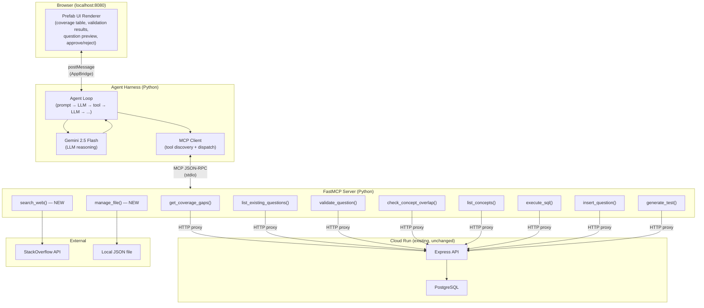
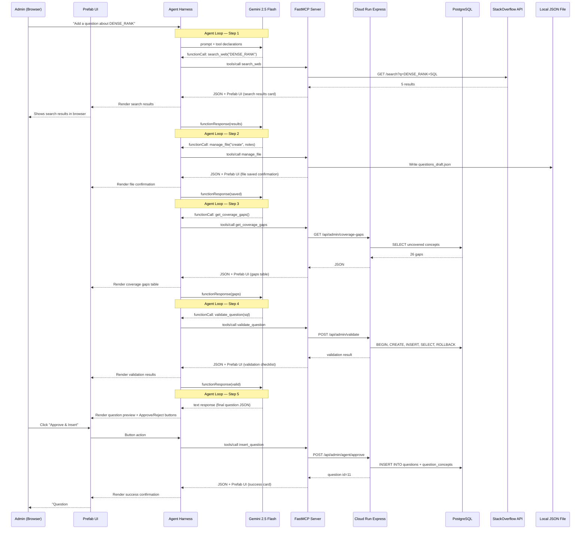

# MCP Agent Architecture — Diagrams

## Architecture

## Sequence Diagram — Full Question Authoring Flow

## Key Design Decisions

1. **Dual output per tool**: Each MCP tool returns JSON (for Gemini to reason with) + Prefab UI (for the admin to see). FastMCP handles this via `structuredContent`.

2. **Existing app unchanged**: Cloud Run Express API stays the same. The Python MCP server is a new layer that proxies HTTP calls to the existing endpoints.

3. **Agent harness is custom Python**: Not Claude Desktop. A Python script that runs the Gemini → MCP tool → Gemini loop, similar to the existing `agent.js` but using MCP protocol instead of direct function calls.

4. **Prefab renders in browser**: Via `fastmcp dev apps` at localhost:8080. Each tool call updates the UI in real-time as the agent works through its steps.

5. **Two new tools for the assignment**: `search_web` (internet requirement) and `manage_file` (local file CRUD requirement). The other 8 are existing tools wrapped with Prefab UI.
