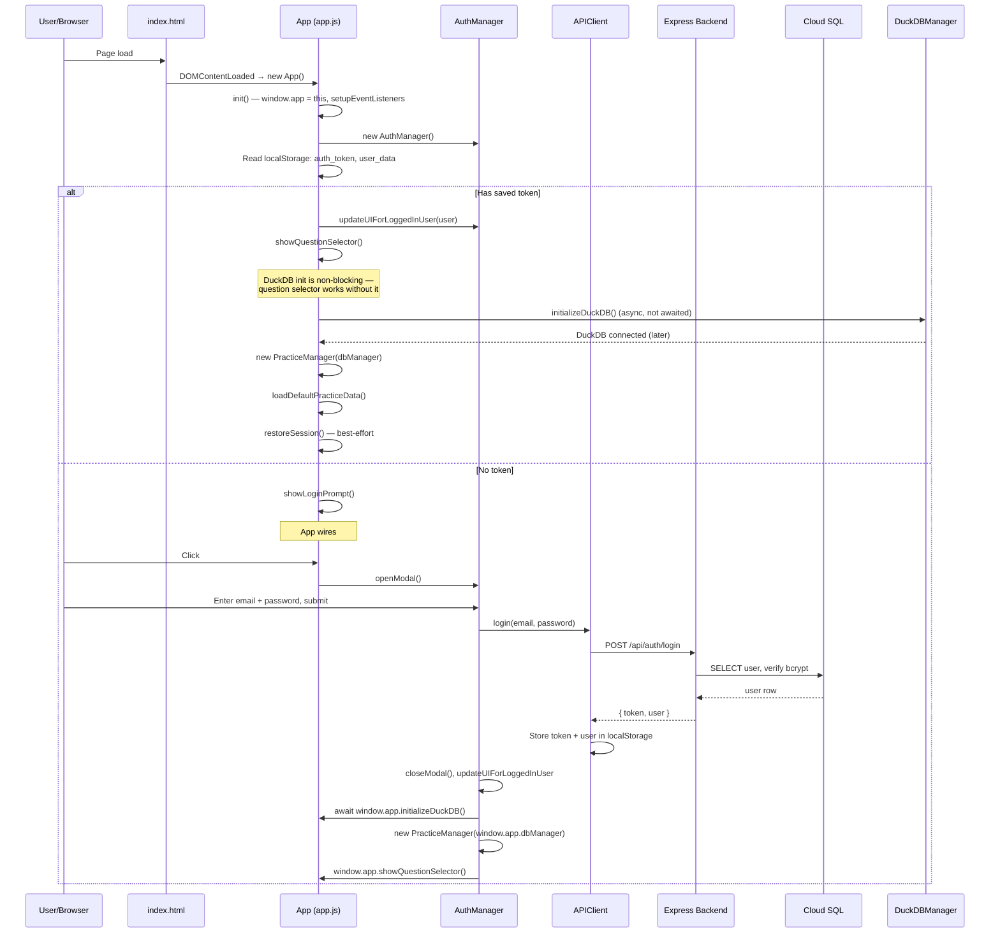
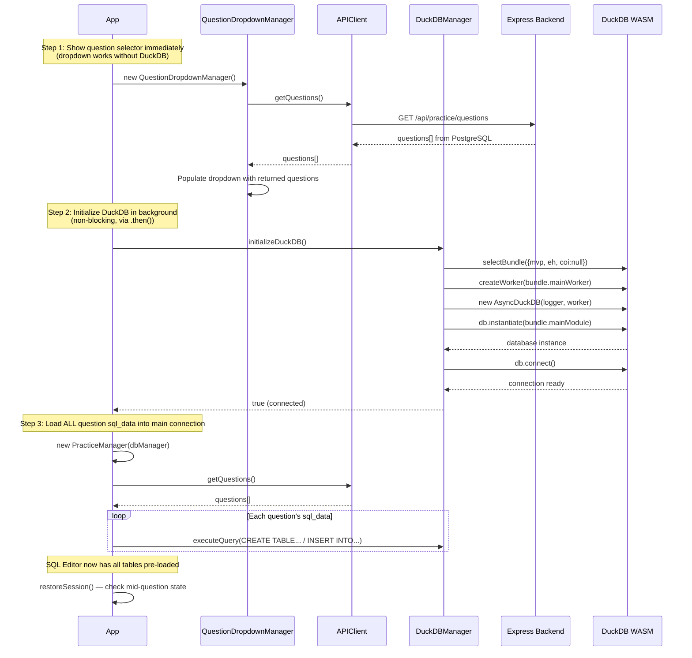
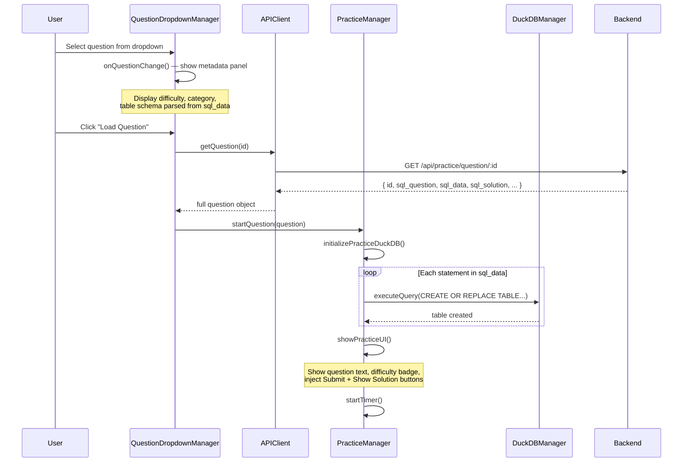
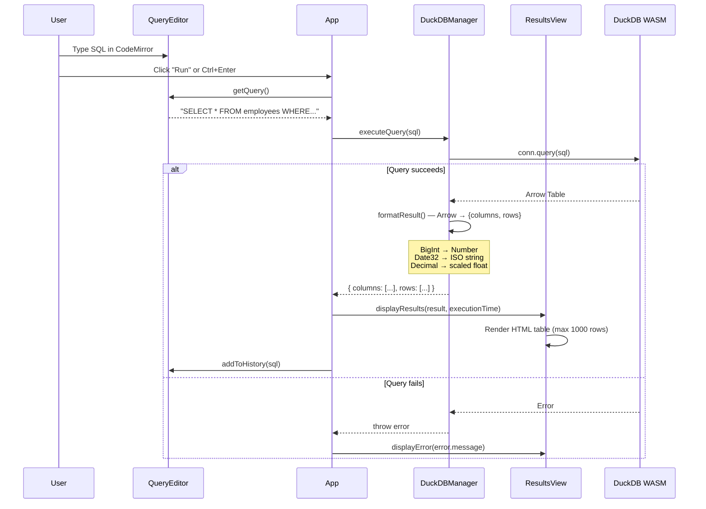
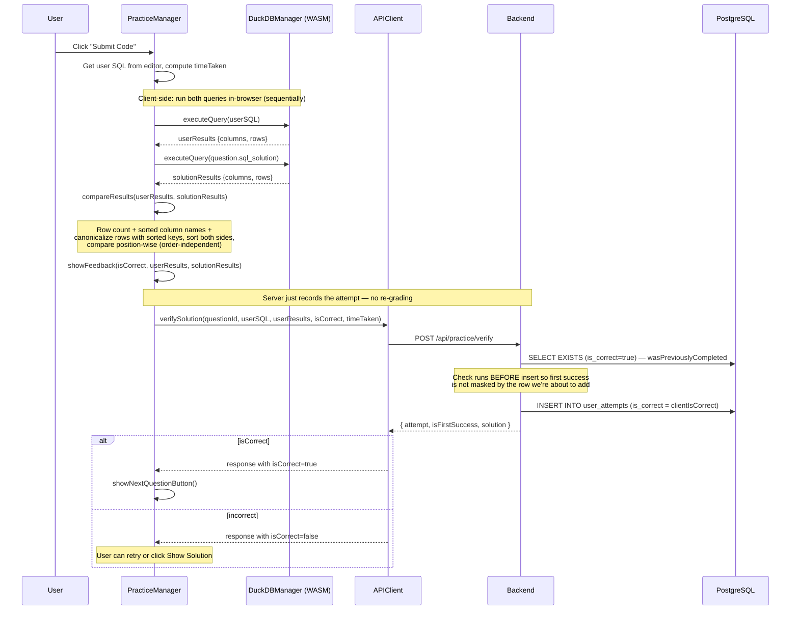
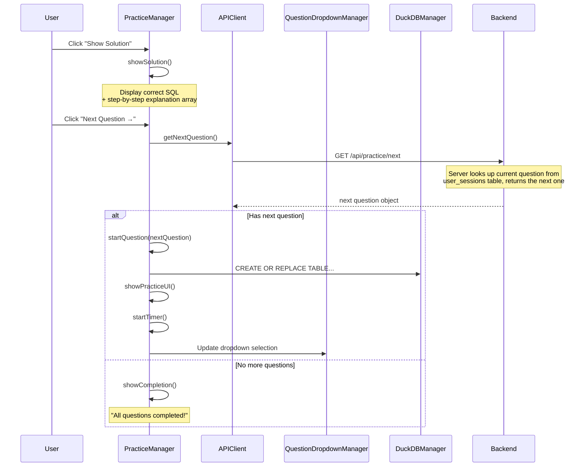
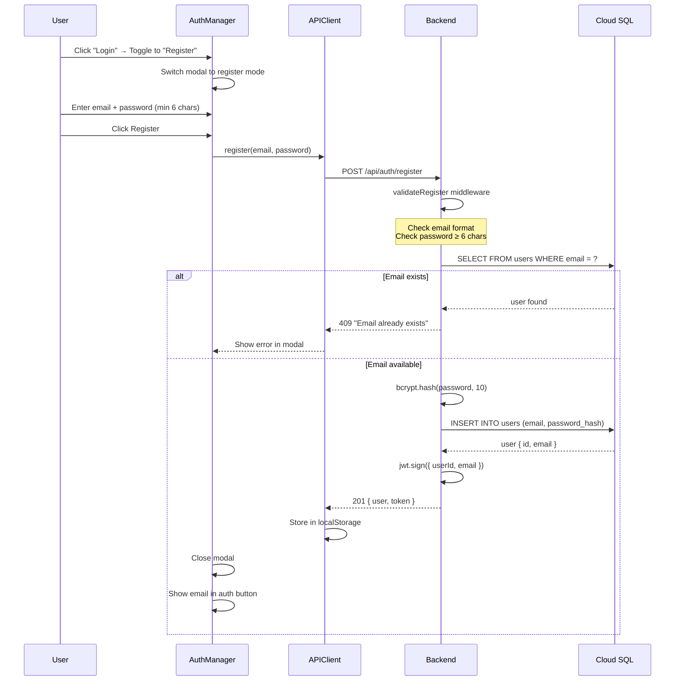
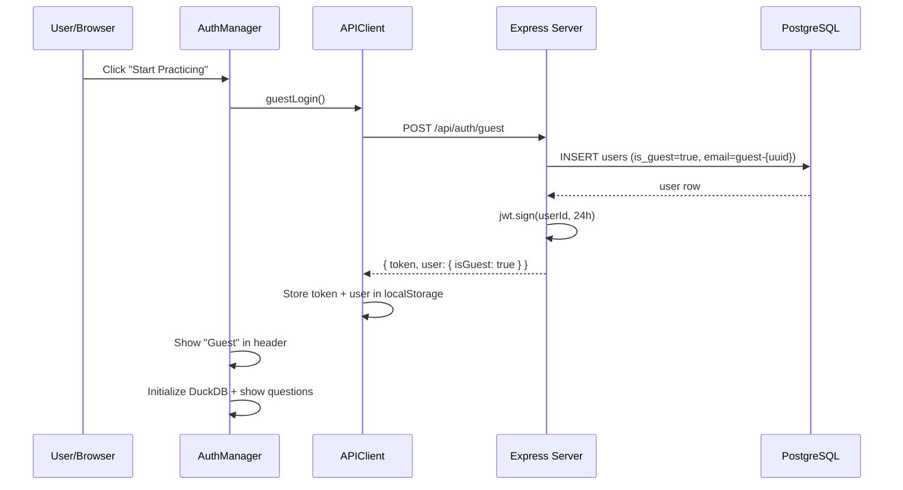
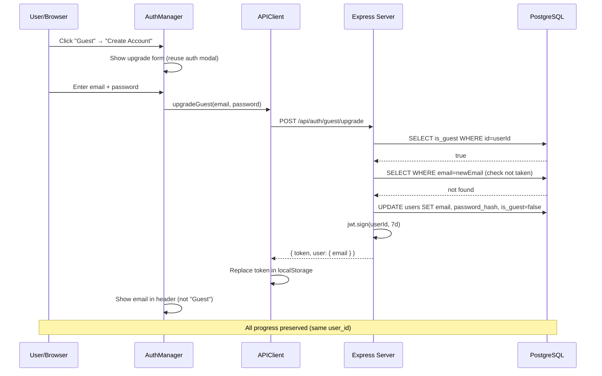

# SQL Practice Project — Sequence Diagrams

## 1. App Startup & Login Flow



## 2. DuckDB Init & Question Loading



## 3. Question Selection & Practice Start



## 4. SQL Execution (Run Query)



## 5. Solution Submission & Grading



## 6. Show Solution & Next Question



## 7. Registration Flow



## 8. Guest Access Flow



## 9. Guest Upgrade Flow



## 10. Question Authoring Agent Flow

```mermaid
sequenceDiagram
    participant A as Admin (Browser)
    participant BE as Express Server
    participant G as Gemini API
    participant DB as PostgreSQL

    A->>BE: POST /api/admin/agent (X-Admin-Key)
    Note over BE: Verify admin key

    BE->>G: generateContent (+ tool declarations)
    G-->>BE: functionCall: get_coverage_gaps()
    BE->>DB: SELECT uncovered concepts
    DB-->>BE: 29 gaps
    BE->>G: functionResponse (gaps)

    Note over BE: wait 7s (rate limit)

    BE->>G: generateContent (+ history)
    G-->>BE: functionCall: list_existing_questions()
    BE->>DB: SELECT all questions
    DB-->>BE: 7 questions
    BE->>G: functionResponse (questions)

    Note over BE: wait 7s (rate limit)

    BE->>G: generateContent (+ history)
    G-->>BE: functionCall: validate_question(sql_data, sql_solution)
    BE->>DB: BEGIN; CREATE TABLE; INSERT; SELECT; ROLLBACK
    DB-->>BE: valid, 12 rows
    BE->>G: functionResponse (validation)

    Note over BE: wait 7s (rate limit)

    BE->>G: generateContent (+ history)
    G-->>BE: text: JSON preview with concepts
    BE-->>A: { steps[], history }

    Note over A: Admin reviews preview
    A->>BE: POST /api/admin/agent/approve
    BE->>DB: INSERT INTO questions
    BE->>DB: INSERT INTO question_concepts (tags)
    BE-->>A: { id: 8, concepts_tagged: ["HAVING"] }
```
