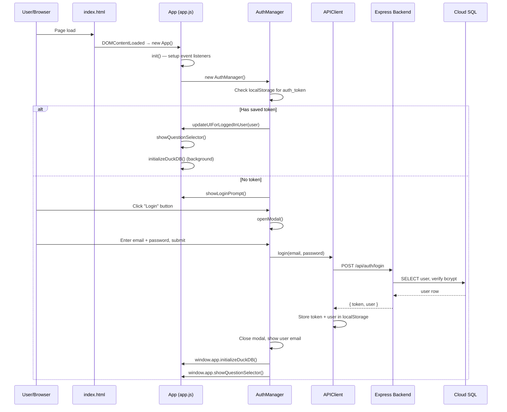
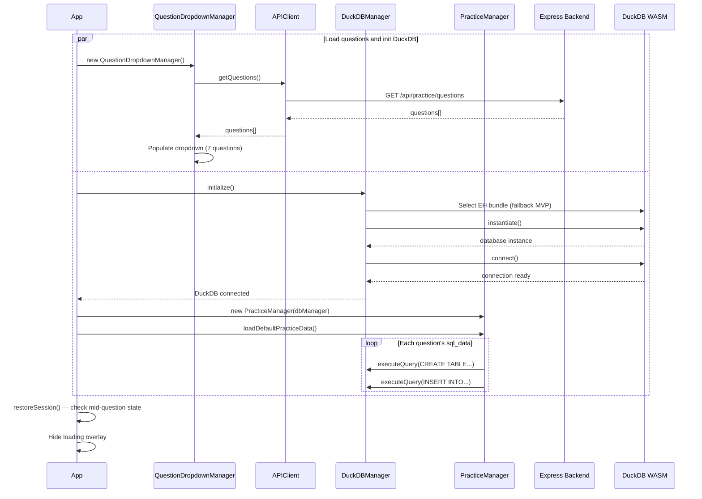
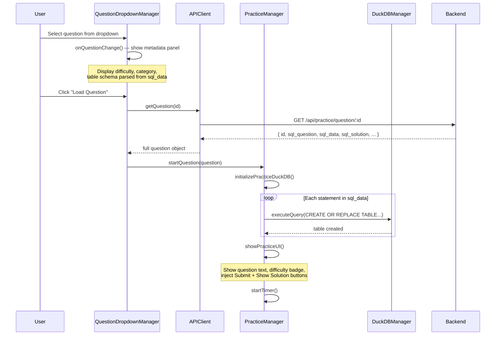
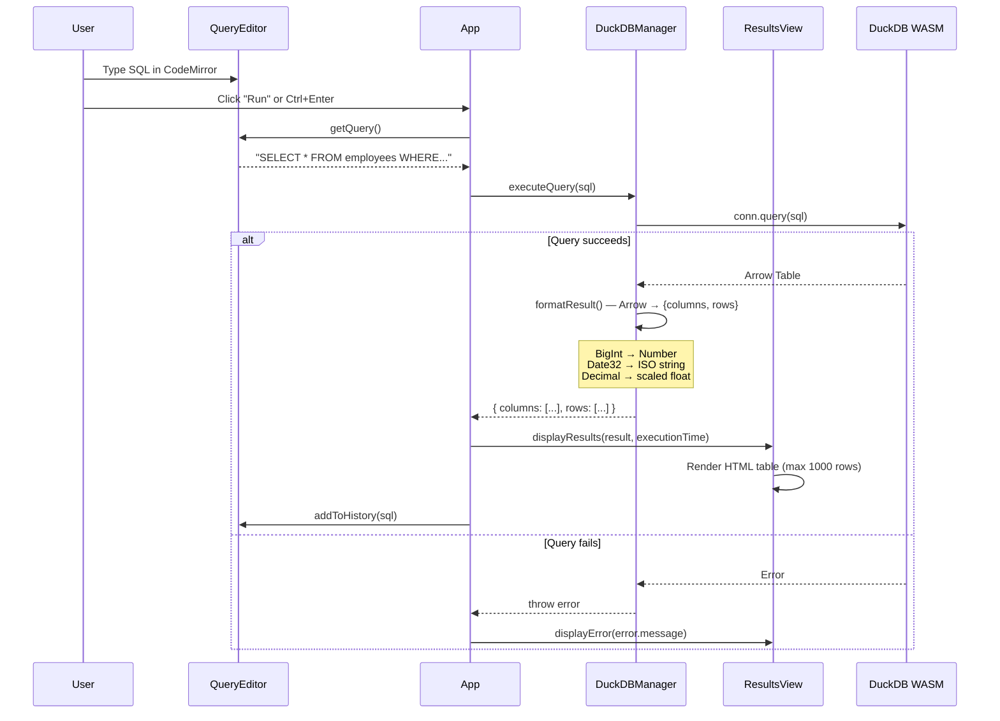
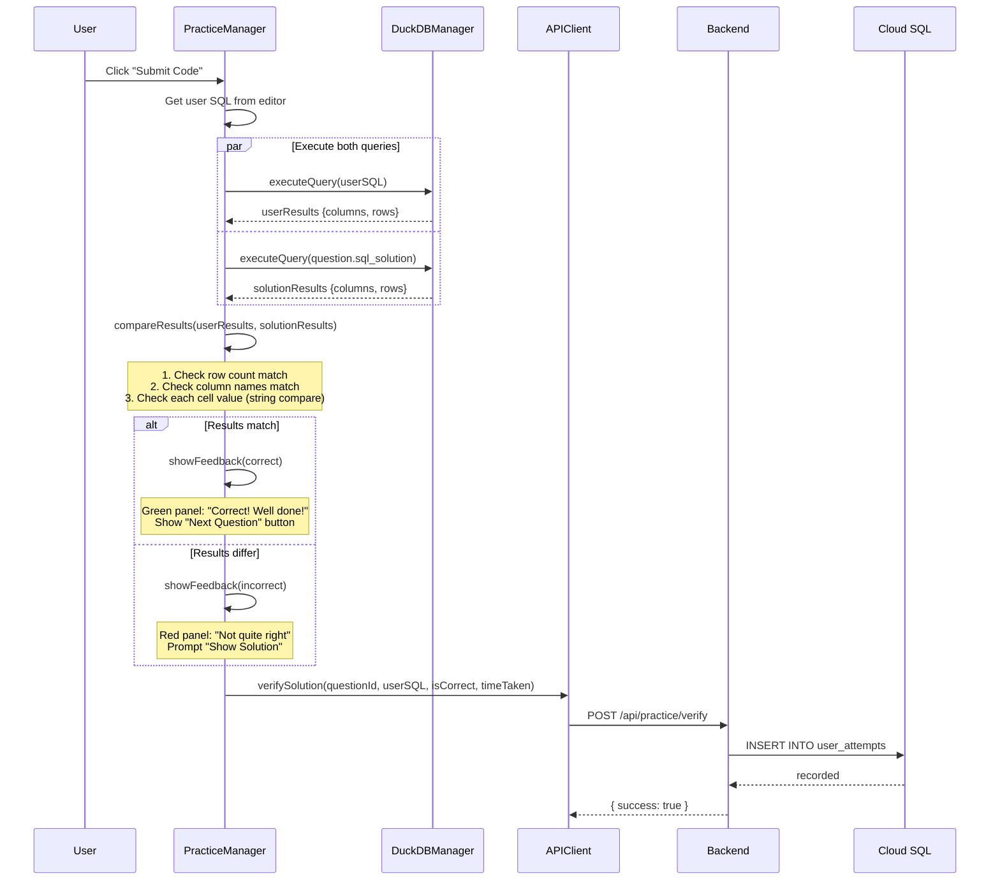
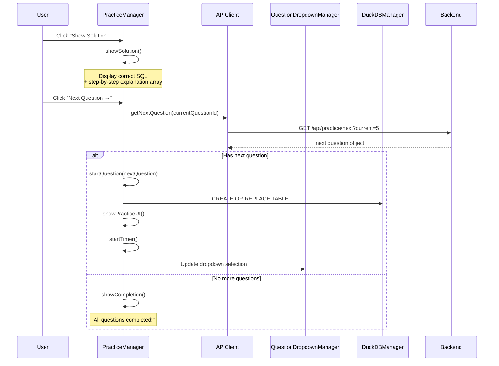
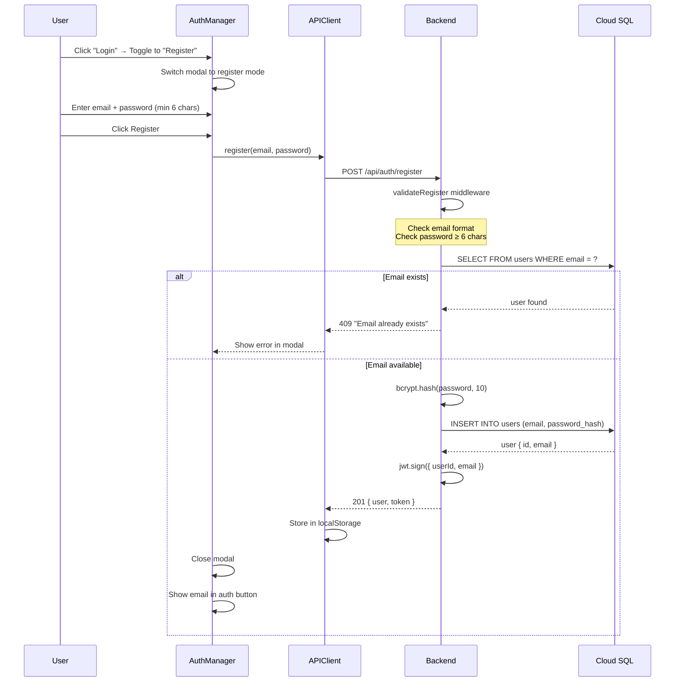

# SQL Practice Project — Sequence Diagrams

## 1. App Startup & Login Flow

## 2. DuckDB Init & Question Loading

## 3. Question Selection & Practice Start

## 4. SQL Execution (Run Query)

## 5. Solution Submission & Grading

## 6. Show Solution & Next Question

## 7. Registration Flow

